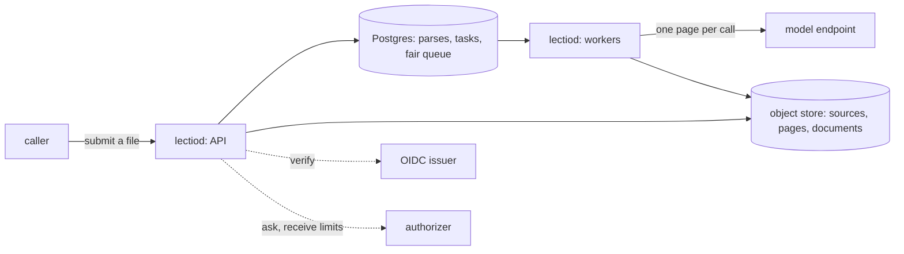

# Lectio

**A control plane that turns a file into a structured document.** Lectio
takes a PDF, an office document, a spreadsheet, or a scan and returns
its content as addressable objects: pages, the blocks on each page with
their kind and position, tables with their cells, and fields shaped by a
schema the caller supplies, each pointing at the blocks it was read
from. Pages are read by a vision-language model behind one interface,
so the model is a line of configuration.

What Lectio owns is the work around the model call. A parse is a graph
of small tasks kept in Postgres: one task prepares the file, one reads
each page, and the rest assemble the document. A worker that dies
loses nothing but its lease. A page that was read is never read again.
Tenants share the workers and the model's rate limit by weight, with an
interactive class ahead of a batch class, and no tenant can queue its
way past another.

> **Status: design under review, scaffold in place.** The specs in
> [`specs/`](specs/README.md) are the design, and none is final. What
> runs today is the whole parsing path and the whole HTTP contract in
> one process with nothing durable: the object model, the interface a
> model sits behind with its first adapters, intake, PDF rendering,
> assembly, and a development server. It has read real PDFs end to end
> with models running locally. The durable tasks and the fair queue are
> designed and not built. Each spec says what of it exists.

## Run it

```sh
make run          # builds out/lectiod and starts it with LECTIO_DEV=true
```

The development server listens on `:8080`, keeps everything in memory,
and takes the token `dev`. With no reader configured it reads pages
with a stub that calls no model, so the path can be followed end to end
before a key exists.

```sh
api=http://localhost:8080/v1
auth='Authorization: Bearer dev'

# Upload a file. The same bytes twice are one file.
curl -s -H "$auth" --data-binary @report.csv "$api/files?name=report.csv"

# Parse it, holding the answer up to 30 seconds for the parse to end.
curl -s -H "$auth" -H 'Prefer: wait=30' -H 'Content-Type: application/json' \
  -d '{"source":{"file":"fil_..."}}' "$api/parses"

# Read the result: whole, as Markdown, one page, one block, or as chunks.
curl -s -H "$auth" "$api/parses/prs_.../document"
curl -s -H "$auth" "$api/parses/prs_.../document?format=markdown"
curl -s -H "$auth" "$api/parses/prs_.../pages/1"
curl -s -H "$auth" "$api/parses/prs_.../blocks/1.2"
curl -s -H "$auth" "$api/parses/prs_.../chunks?by=section"

# A figure as an image of its own, and what the figures show.
curl -s -H "$auth" "$api/parses/prs_.../blocks/4.1/image" -o figure.png
curl -s -H "$auth" -H 'Prefer: wait=30' -X POST "$api/parses/prs_.../figures"
```

A page is readable as soon as it was read, while the rest of the parse
is still running. How a result looks is chosen when it is read, so
another format or another chunk size never runs the parse again. The
contract is [`api/openapi.yaml`](api/openapi.yaml), and the server
serves it at `/v1/openapi.yaml`.

A reader that finds a figure says where it is. Describing figures is a
second request against the same parse: each figure is cut from its page
and described alone, and no page is read again.

To read pages with a model, declare a reader and point `LECTIO_CONFIG`
at the file. Any endpoint that speaks the OpenAI chat completions API
works, a gateway included:

```yaml
apiVersion: lectio.latere.ai/v1
kind: Reader
metadata: { name: default }
spec:
  adapter: chat
  endpoint: https://gateway.example/v1
  model: your-vision-model
  image: { dpi: 160, longEdge: 2048, format: png }
  constrained: true
```

```sh
LECTIO_DEV=true LECTIO_CONFIG=reader.yaml LECTIO_MODEL_KEY=... out/lectiod
```

This build reads PDFs and images (PNG, JPEG, TIFF) through a reader,
and text, Markdown and CSV from the file itself. Every PDF page is
rendered and sent to the reader; reading the text a PDF already carries
is designed and not built.

To check a reader against a real file, end to end:

```sh
LECTIO_LIVE_CONFIG=reader.yaml LECTIO_LIVE_FILE=paper.pdf make live
```

It parses the file with that reader and writes the Markdown, each
page's blocks and each page's image to `LECTIO_LIVE_OUT` when it is
set. It calls a model, so it is never part of `make check`.

## What it is for

A language model, a search index, or a workflow cannot use a scanned
contract or a 400-page report as a file. It needs the text in reading
order, the tables as tables, and a way to point back at the place on
the page a value came from. Hosted vision-language models read a page
well, and a single call is easy. Reading ten thousand pages for forty
tenants through a rate-limited API, without losing work to a restart
and without one tenant's backlog stalling the rest, is the part that
takes a system.

Lectio is that system, and nothing else: it does not serve models,
store files beyond the parse, or hold accounts. Identity comes from any
OpenID Connect issuer. Permission and limits come from an endpoint the
operator writes. Models are reached through any OpenAI-compatible
endpoint, a gateway included.

## Shape



## License

Apache-2.0. See [LICENSE](LICENSE).
