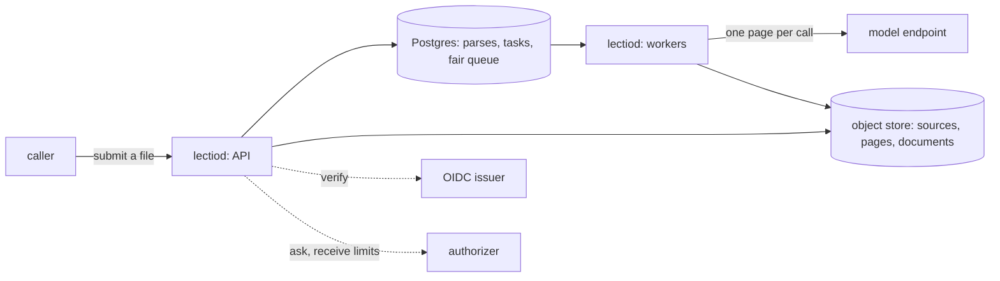

# Lectio

**A control plane that turns a file into a structured document.** Lectio
takes a PDF, an office document, a spreadsheet, or a scan and returns
its content as addressable objects: pages, the blocks on each page with
their kind and position, tables with their cells, and fields shaped by a
schema the caller supplies, each pointing at the blocks it was read
from. Pages are read by a vision-language model behind one interface,
so the model is a line of configuration.

What Lectio owns is the work around the model call. A parse is a graph
of small tasks kept in Postgres: one task prepares the file, one reads
each page, and the rest assemble the document. A worker that dies
loses nothing but its lease. A page that was read is never read again.
Tenants share the workers and the model's rate limit by weight, with an
interactive class ahead of a batch class, and no tenant can queue its
way past another.

> **Status: design under review.** This repository holds the specs and
> no implementation yet. Start with
> [`specs/001-architecture.md`](specs/001-architecture.md); the index in
> [`specs/README.md`](specs/README.md) lists every spec in build order.

## What it is for

A language model, a search index, or a workflow cannot use a scanned
contract or a 400-page report as a file. It needs the text in reading
order, the tables as tables, and a way to point back at the place on
the page a value came from. Hosted vision-language models read a page
well, and a single call is easy. Reading ten thousand pages for forty
tenants through a rate-limited API, without losing work to a restart
and without one tenant's backlog stalling the rest, is the part that
takes a system.

Lectio is that system, and nothing else: it does not serve models,
store files beyond the parse, or hold accounts. Identity comes from any
OpenID Connect issuer. Permission and limits come from an endpoint the
operator writes. Models are reached through any OpenAI-compatible
endpoint, a gateway included.

## Shape

## License

Apache-2.0. See [LICENSE](LICENSE).
