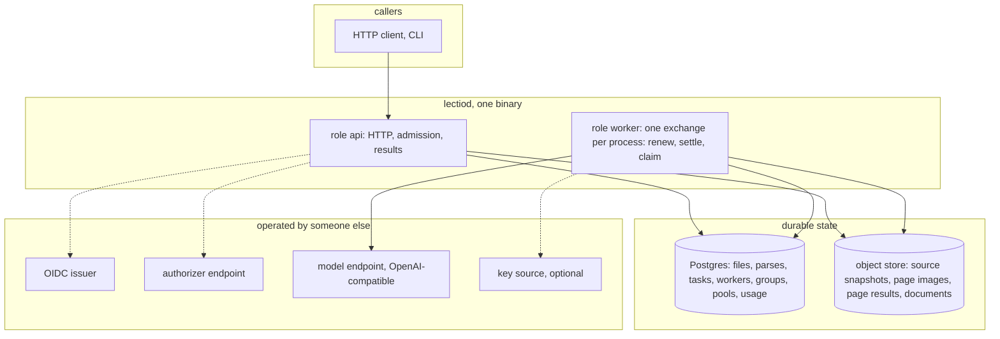
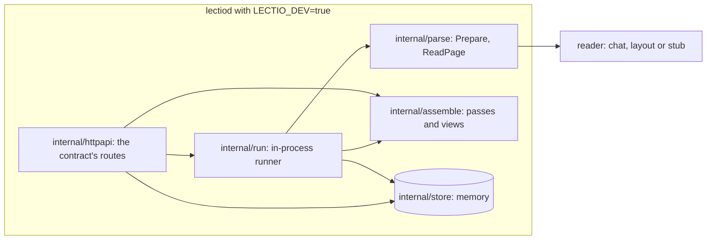

# Architecture

## Overview

Lectio turns a file into a structured document. A caller submits a file
and receives a parse: an asynchronous job whose result is the file's
content as pages, blocks, tables and extracted fields
([[002-object-model]]). Each page is read by a vision-language model.
Lectio does not run that model. It owns everything between the submit
and the result: accepting and snapshotting the file, splitting it into
pages, scheduling one small task per page, sharing the model's capacity
between tenants, retrying what fails, assembling the pages into one
document, and keeping every step durable.

This spec fixes the components, the boundaries between them, and the
invariants every other spec assumes.

## Current state

A scaffold is built in this repository: the object model, the reader
interfaces and their adapters, the steps of a parse, the API, and a
development server that runs them in one process and keeps nothing.
The durable control plane this spec describes is not. An earlier
service of the same name parsed documents for one deployment: it detected file types,
converted office formats, extracted text natively where the format
carried it, called a self-run OCR model per page, and scheduled parses
between tenants. Its queue lived in process memory, a parse was one
unit of work, and a restart began every running parse again from the
first page. Its intake, layout and formatting packages are sound and
are carried over; its queue, its worker pool and its model client are
replaced. Each spec says under this heading what it carries over.

## Design

### Components

- **`lectiod`** is one binary. `--role api` serves HTTP, `--role worker`
  runs tasks, and the default runs both in one process. Replicas of
  either role coordinate only through Postgres. No replica is a leader.
- **Postgres** holds every fact that must survive a process: files,
  parses, tasks, the workers and their leases, the fair queue's
  accounting, model pool state, and usage. It is the only queue: there
  is no broker. A worker process talks to it through one call, the
  exchange, which renews the worker's lease, settles what finished,
  reports what was canceled, and claims new work, in one statement
  ([[004-durable-tasks]]).
- **The object store** (S3-compatible) holds bytes: the source
  snapshot, each page's rendered image, each page's result, and the
  assembled document. A database row never holds an image or a page of
  blocks.
- **The model endpoint** reads a page. Lectio speaks the
  OpenAI-compatible chat completions shape with image input and a JSON
  schema for the reply, and a small HTTP contract for an OCR or layout
  engine someone runs themselves ([[008-readers]]). Pointing the first
  at a gateway is what makes the model a line of configuration. How a
  model is asked, its prompt, its box convention and its request
  parameters, is the reader's configuration and not the same for every
  model.
- **The issuer and the authorizer** answer who is calling and what the
  caller may do, with which limits ([[012-identity-and-authorization]]).
- **The key source**, when configured, supplies the model credential a
  tenant's pages are read with, so model spend lands on that tenant
  ([[013-limits-and-usage]]).

### The path of one parse

1. `POST /v1/parses` names a file ([[003-api]], [[014-sources-and-retention]]).
   The API verifies the token, asks the authorizer, reads the limits on
   the allow, and writes a parse and its first task, `prepare`, in one
   transaction. It answers `202`.
2. A worker claims `prepare` ([[004-durable-tasks]]). It snapshots the
   source, detects the type, converts what needs converting, counts
   pages, writes the pages of a format that carries its own structure,
   and writes one `page` task per selected page that a reader has to
   read ([[005-parse-graph]], [[009-intake]]).
3. Workers claim page tasks. Which tenant's task a worker takes next is
   the fair queue's decision ([[006-fairness-and-priority]]). Whether
   the model has room for the call is the pool's
   ([[007-model-capacity]]), and a task is claimed only when it has. A
   page that an earlier parse of the same caller read whole, from the
   same bytes with the same readers, is taken from that read
   ([[002-object-model]]). Otherwise the worker renders the page, calls
   a reader, validates the reply, and writes the page result under a
   key that carries its lease token.
4. The settle of the last page inserts `assemble`, which builds the
   document ([[010-assembly]]). The settle of `assemble` ends the
   parse: it records usage and the terminal state in the same
   transaction. There is no task after it.
5. The caller reads state, pages as they land, and the document, in
   the view it chooses when it reads.
6. A caller that wants an object in the shape of a schema asks for a
   field of the parse, then or later; an `extract` task fills it from
   the document and reads no page
   ([[011-structured-extraction]]).

### Invariants

1. **A committed step is never redone.** A task's output is written to
   a key that carries its lease token before the task is settled, and
   the settle records the key. A retry of a parse re-runs only tasks
   that did not succeed.
2. **A lost process loses a lease, not work.** A worker process holds
   one lease, on its own row, with an expiry on the database clock, for
   everything it runs. When it expires, the worker's tasks return to
   the queue. No parse depends on the process that accepted it.
3. **A stale worker cannot write.** Every claim of a task raises the
   task's token. A settle is accepted only from a live worker that
   holds the current token of a task that is still leased, so a worker
   that was taken for dead, a task that was reissued, and a task that
   was canceled each settle nothing. The object store is inside the
   fence: a stale worker's late write lands on a key nothing points at.
4. **Fairness is chosen before the task.** The dispatcher picks a
   tenant, then that tenant's next task. Nothing a tenant queues can
   change which tenant is picked.
5. **Waiting for capacity is not failing, and writes nothing.** A task
   whose reader has no room, because its pool is full, paused by a
   rate limit, or behind an open breaker, is not claimed. It spends no
   attempt and no statement.
6. **Cancel stops work at once.** A cancel moves the parse and its
   queued and leased tasks to `canceled` in one transaction. A page
   that finishes afterwards settles against a row that is no longer
   leased and is not recorded. The worker running it learns at its next
   exchange and aborts its model call.
7. **Memory is bounded by a page.** No role holds a whole document, a
   whole result, or more than one page image per running task in heap.
8. **An option is honored or refused.** The API rejects a field it does
   not implement. Nothing is accepted and ignored.
9. **The core verifies and asks.** It never reads a claim for meaning,
   holds no account, and decides nothing about a person. With no
   authorizer configured, the built-in owner policy applies.
10. **Nothing here names a deployment.** No hostname, vendor account,
    or model identifier is compiled in. Defaults that appear are
    examples.

### What Lectio does not own

- Serving or hosting a model, and managing accelerator capacity for
  one. The scarce resource is the model endpoint's rate limit and the
  tenant's budget, not a GPU.
- Storing a caller's files beyond the parse. A source is a snapshot
  with a retention period.
- Accounts, billing, plans and prices. It records what it did
  ([[013-limits-and-usage]]) and enforces the limits it is handed.
- A user interface.

### Dependencies

Go, with no cgo. `latere.ai/x/pkg` for the JWT verifier, the authorizer
contract, embedded migrations, the S3 client, telemetry, retry and
health probes. Postgres 16 or later. Any S3-compatible object store.
A memory store and a local-directory object store exist for tests and
for a one-process development run; neither is durable and `lectiod`
says so at start.

## Implementation status

Built: the path of one parse, in one process and in memory.

- A submit stores a parse and hands it to the runner. The runner
  prepares the file once, reads it page by page with a shared set of
  workers, assembles, and sets the terminal state. It assembles on
  every terminal state, so a parse that was canceled or ran out of time
  still has a document of what it read.
- A PDF's pages are rendered in the process, by a PDF engine compiled
  to WebAssembly, with no C library and no second service
  ([[009-intake]]).
- Invariants 5 and 8 hold: a rate limit spends no attempt, and a
  member the contract does not name is refused. Invariant 4 holds in
  shape: the runner picks an owner, then that owner's page, with every
  owner's weight at one and no account of what each was served.
  Invariant 6 holds within one process: a cancel stops a parse between
  pages, ends the call in flight, and drops what that call returns.
  Invariant 10 holds.
- Both readers were run against real models on one machine, a
  specialized engine behind the layout adapter and a general vision
  model behind the chat adapter ([[008-readers]]).

Remaining: both roles as separate processes, Postgres, the object
store, the issuer, the authorizer and the key source, and with them
invariants 1 to 3, 7 and 9, and the fair queue behind invariant 4.
Each is the subject of the spec linked above.

## Not in this spec

Wire shapes, table layouts, algorithms and configuration variables:
each belongs to the spec linked above. Packaging, images and the
configuration reference are [[016-distribution]]. Telemetry is
[[015-observability]].

## Acceptance criteria

| Criterion | Proven by |
|---|---|
| `lectiod` runs as `api`, as `worker`, and as both, and a parse submitted to an `api` replica completes on a separate `worker` replica | an end-to-end test with two processes over one Postgres and one bucket |
| Killing every worker mid-parse and starting a new one completes the parse, and no page succeeded twice | a test that kills the worker process after k of n pages and counts reader calls per page |
| Two worker replicas over one database never both settle one task, and a page's stored result is the one whose settle was accepted | a concurrency test asserting one accepted settle per task and reading the result through the row |
| The API holds no parse state in memory: restarting it between submit and result changes nothing | an end-to-end test |
| With no issuer, authorizer, model endpoint or key source configured, `lectiod` refuses to start in production mode and names the missing setting; in development mode it starts with the stub reader and says so | start-up tests |
| A heap profile taken while a 500-page parse runs shows no allocation proportional to the page count in either role | a memory test over a generated document |
