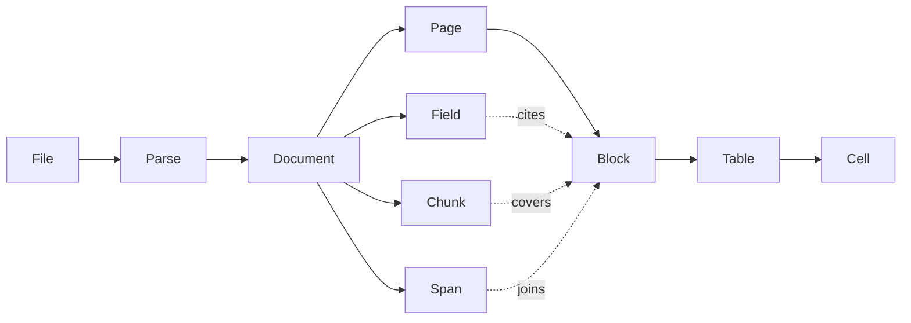

# Object model

## Overview

A parse turns one file into one document, and a document is a tree of
small objects a caller can address one at a time: a page, a block on
that page, a cell in a table, a field of an extraction. This spec names
those objects, their identifiers, their coordinates, and which store
holds each. Every other spec reads and writes these shapes.

## Current state

The earlier service had a layout model with pages, elements, table
cells and nineteen element kinds, and a reference scheme of
`page.order`. That model is carried over with four changes: boxes are
normalized instead of being in points or pixels depending on the
source, the confidence field that nothing ever set is removed, page
images leave the document, and a block's kind set is cut to what a
reader is asked to produce. The public Go package is `document`.

## Design

### The objects



| Object | What it is | Identifier |
|---|---|---|
| File | a source snapshot: bytes with a size, a SHA-256, a detected media type, a name, and an optional origin | `fil_` + 26 characters |
| Parse | one request to turn a file into a document: options, state, progress, usage | `prs_` + 26 characters |
| Document | the result of a parse | the parse's id |
| Page | one page, sheet, slide or image frame, in source order | its number, from 1 |
| Block | one region of a page with one kind | `ref`: `<page>.<order>` |
| Table | the structure of a block of kind `table` | the block's `ref` |
| Cell | one cell of a table | its `row` and `col` within the table, from 0 |
| Span | a table that continues across pages, as a join of blocks | `s<n>` |
| Field | one extraction result for one named schema | the schema's name |
| Chunk | a run of blocks rendered as text, for retrieval | `c<n>` |

Identifiers with a prefix are ULIDs, so they sort by creation time, and
two made in the same millisecond still sort in the order they were
made. A list ordered by id is therefore ordered by time, which is what
a list cursor relies on ([[003-api]]). A `ref` is stable for as long as
its page is not read again: a retry that re-reads a page replaces that
page's blocks and their refs together. What that costs is under Open
below.

### Page

```json
{
  "number": 3,
  "width": 595.0, "height": 842.0, "rotation": 0,
  "state": "succeeded",
  "source": "reader",
  "reader": "default", "model": "some-model",
  "attempts": 1,
  "blocks": [ ... ],
  "usage": { "pages": 1, "input_tokens": 11000, "output_tokens": 2600 }
}
```

`width` and `height` are in points (1/72 inch) for paged formats and in
pixels for images. `source` is `reader` when a model read the page and
`native` when the format carried its own structure ([[009-intake]]).
`reader` and `model` are absent on a native page. `usage` is what
reading the page consumed: `pages`, `input_tokens`, `output_tokens`,
and `cost` with `currency` only when the model endpoint reported a
cost.

`state` is one of four:

| State | Meaning |
|---|---|
| `pending` | not read yet; the parse is still running |
| `succeeded` | read; the page holds its blocks |
| `failed` | could not be read; the page has an `error`, as `{"code", "detail"}`, and no blocks |
| `skipped` | the parse ended, canceled or out of time, before the page was read; nothing went wrong with the page, and it has no error and no blocks |

Two members say how a succeeded page came to be, and each is absent
when false:

- `truncated`: the reader's reply ended at its output limit. The
  blocks are what the reply finished, the last of them is flagged, and
  the page may hold more ([[008-readers]]). A truncated page is never
  kept for reuse.
- `reused`: the result was taken from an earlier read of the same page
  and no model was called for it in this parse. Its `usage` is one
  page and no tokens.

### Block

```json
{
  "ref": "3.4",
  "kind": "table",
  "order": 4,
  "box": [0.08, 0.31, 0.92, 0.58],
  "text": "Quarter | Revenue ...",
  "table": { "rows": 6, "cols": 3, "cells": [ ... ], "html": "<table>...</table>" }
}
```

```json
{
  "ref": "4.1",
  "kind": "figure",
  "order": 1,
  "box": [0.14, 0.07, 0.81, 0.31],
  "text": "Q1 Q2 Q3 Q4",
  "description": "A bar chart of revenue by quarter.",
  "figure": { "type": "chart", "model": "some-vision-model" }
}
```

- `kind` is one of: `title`, `heading`, `text`, `list_item`, `table`,
  `figure`, `formula`, `form`, `key_value`, `caption`, `footnote`,
  `page_header`, `page_footer`, `page_number`, `signature`, `barcode`,
  `code`. A label a reader returns outside this set becomes `text`.
  The set is closed: adding a kind is a change to this spec.
- `order` is the reading order within the page, dense from 1. Reading
  order across pages is page order.
- `box` is `[x0, y0, x1, y1]` as fractions of the page's width and
  height, origin at the top left, `x0 < x1` and `y0 < y1`. A block with
  no known position, which is every block of a `native` page, has
  `"box": null`. One coordinate system for every source is what lets a
  client draw an overlay without knowing how the page was rendered.
- `text` is what is printed in the region, as plain text, and nothing
  else. For a table it is the cells joined row by row. For a figure it
  is the words printed inside it, and empty when there are none.
- `description` is what a reader says a figure shows, in the reader's
  own words. It is present on a figure only. It is not transcription:
  it is kept apart from `text` so that a rendering can mark it, a chunk
  can leave it out, and an extraction never cites it as something the
  document says ([[010-assembly]], [[011-structured-extraction]]). The
  first draft put the description in `text`, where prose a model wrote
  was indistinguishable from what the page printed.
- `figure` is present on a figure once it was described
  ([[008-readers]]): `type` is one of `diagram`, `chart`, `photo`,
  `table` and `other`, and `model` is the model that described it. A
  reader that finds a figure need not say what it shows; a describer
  does, on request, and what it returns fills `description`, `figure`,
  and, when the page's reader gave the block no text, `text` with the
  words printed inside the figure. `figure` is on a block of kind
  `figure` and on no other.
- `level` is the heading depth, 1 to 6, on `title` and `heading`, and
  absent on every other kind.
- `table` is present on a block of kind `table` and on no other.
- `repeated` marks a running header or footer after its first
  occurrence, found by [[010-assembly]]. It is absent when false. A
  rendering prints such a block once unless the reader of the result
  asks otherwise ([[003-api]]).
- There is no confidence value. A reader does not return one that can
  be compared across models, and a field that is always absent or
  always wrong is worse than none. What a block does carry is `flags`,
  set by validation ([[008-readers]]): `box_clamped`, `kind_coerced`,
  `truncated`.
- `ref`, `kind`, `order`, `box` and `text` are always present. The
  other members are present only when they say something.

### Table

`cells` is a list of `{row, col, row_span, col_span, header, text,
box}`, with `row` and `col` counted from 0, the spans present only on a
cell that spans, and `header` present and true on a cell of a header
row or column. A cell's `text` keeps a raised or lowered run as `^` or
`_`, so n squared does not become n2.

`html` is the table as markup with merged cells, the one form that
carries spans without loss. It is written from the cells and is not the
reader's own markup. The first draft kept the reader's markup verbatim.
That markup comes from a model that read a file somebody else wrote,
and whatever the file led the model to write, a script, an event
handler, a link, would be served to whoever renders the result. Markup
written from the cells holds a table and nothing else: `table`, `tr`,
`th`, `td`, `rowspan`, `colspan`, and escaped text. Markdown is
rendered from the cells on request, never stored.

### Span, Field, Chunk

- A Span is `{"id": "s1", "parts": ["3.4", "4.1"], "rows": 41, "cols": 3}`.
  The per-page tables stay as they are; a span adds the join.
- A Field is `{"name", "state", "data", "citations", "model",
  "constrained", "attempts", "windows", "usage", "error"}`, where
  `citations` maps a JSON pointer into `data` to a list of block refs
  ([[011-structured-extraction]]).
- A Chunk is `{"id", "text", "pages", "blocks"}`. Chunks are computed
  when they are read and are not stored ([[010-assembly]]).

### Document

The document of a parse is an index, not a copy of its pages:

```json
{
  "parse": "prs_01J...",
  "pages": [ { "number": 1, "state": "succeeded", "source": "reader", "blocks": 14 } ],
  "spans": [ ... ],
  "outline": [ { "ref": "1.1", "level": 1, "text": "Annual report", "page": 1 } ],
  "usage": { "pages": 120, "input_tokens": 1310000, "output_tokens": 302000 },
  "renderings": ["markdown", "text"],
  "fields": ["invoice"]
}
```

Each entry of `pages` is a page without its blocks: its number, state
and source, how many blocks it holds, and its error when it failed.
A page's blocks are read by page, which is what keeps a long document
out of memory and out of one reply.

### Where each is stored

| Data | Store | Key or table |
|---|---|---|
| File metadata, parse state, progress, usage | Postgres | `files`, `parses` |
| Tasks, leases, queue accounting, pools | Postgres | [[004-durable-tasks]], [[006-fairness-and-priority]], [[007-model-capacity]] |
| Source snapshot | object store | `sources/<owner key>/<sha256>`, the owner key a hash of the owner ([[014-sources-and-retention]]) |
| Working copy after conversion | object store | `parses/<parse>/work/source.<ext>` |
| Page image | object store | `parses/<parse>/pages/<n>.<token>.png`, raw image bytes |
| Page result | object store | `parses/<parse>/pages/<n>.<token>.json` |
| Document index | object store | `parses/<parse>/document.<token>.json`: page list with each page's key, spans, outline, usage, without blocks |
| Field | object store | `parses/<parse>/fields/<name>.<token>.json` |

Renderings and chunks are not stored. They are views of the page
results, made when a caller reads them with the options that caller
chose ([[003-api]], [[010-assembly]]), so no stored copy can be the
wrong view.

The page is the unit of storage and the block is the unit of
addressing. A block is not a database row: a 3,000-page document has
on the order of a hundred thousand blocks, they are written once and
read by page, and a row per block would put the largest table in the
system behind every claim query for no read it serves. The API
resolves a block ref by reading its page object ([[003-api]]).

A key carries the lease token of the task that wrote it
([[004-durable-tasks]]). A model's replies to the same page are not
equivalent, so two workers that ran one task after a crash must not
write one key: each writes its own, the task's settle records the key
of the one that was accepted, and a stale worker's late write lands on
a key nothing points at. A page is found through its task row while the
parse runs, and through the document index, which lists the winning key
of every page, after ([[005-parse-graph]]). The first draft made every
key deterministic from the parse and the page number and called a
second write equivalent; it is not. An image is stored as image bytes,
never as base64 inside JSON.

### Reuse is by page

A page's result is kept, per owner, under a key that names what was
read: the digest of the file's bytes, the page's number, the language
hints, and the name and version of every reader that may come to read
the page ([[008-readers]]). A later parse of the same owner that would
do the same read takes the result and calls no model. The page it gets
says `reused`.

- Only a page that was read whole is kept. A failed page, a skipped
  page and a truncated page are read again.
- A reader that describes itself with no version makes no promise
  about its results, and its pages are never reused.
- A parse is always a new one, with its own id, labels and origin.
  There is no reuse of a whole parse and no fingerprint of a parse's
  options. The first draft returned an earlier parse in place of a new
  one, which dropped the new submit's labels and origin, answered a
  submit that tolerated no failed page with a parse that had some, and
  could not reuse three pages of a ten-page selection. The page is the
  unit of work, so it is the unit of reuse.

### Open

A block's `ref` is `<page>.<order>`, and a page that is read again is
renumbered. Reading one page, or one region of it, again with a
stronger reader would therefore break every citation into that page.
Two changes would allow it: a revision on the page, or block ids that
do not follow reading order; and provenance on the block, the reader
and model that produced it and a confidence when an engine gives one,
so a caller can tell a block that was read again from one that was not.
Neither is designed. They are the owner's decision, and they decide
whether a page or a region can be read twice within one parse.

## Not in this spec

How blocks are produced ([[008-readers]], [[009-intake]]), how spans and
`repeated` are computed ([[010-assembly]]), the HTTP shapes that return
these objects ([[003-api]]), and retention ([[014-sources-and-retention]]).

## Implementation status

Built:

- The `document` package: every object above as a Go type with its
  JSON form, the closed set of kinds, box repair and validation, block
  numbering and refs, and page validation.
- `internal/id`: prefixed ULIDs that keep their order within one
  millisecond.
- `internal/store`: a memory store for files, parses, pages, page
  images, document indexes, the page results and figure descriptions
  kept for reuse, and the run that describes a parse's figures. It
  holds everything in the process and nothing survives a restart.
- A block's `figure` member, filled when a figure is described, and a
  block's image as a cut of its page's image.
- Reuse by page, in the in-process runner over the memory store.

Remaining:

- The Postgres tables and the object store layout of the table above,
  with keys that carry a lease token.
- A cell's `box`: no adapter sets one yet.
- What is under Open.

## Acceptance criteria

| Criterion | Proven by |
|---|---|
| The `document` package round-trips every object through JSON without loss, and rejects a box outside `[0,1]`, an inverted box, an unknown kind, and a duplicate ref | unit tests over golden files |
| A block ref resolves to the same block before and after assembly, and after a retry that did not re-read its page | an end-to-end test |
| A figure's description is never in its `text`, in a chunk, or in the input of an extraction | unit tests of normalization and of the views |
| A table's `html` holds no element or attribute beyond a table's own, whatever markup the reader returned | a unit test with hostile markup |
| A second parse of the same bytes by the same owner and readers has its own id and labels, calls no model for pages the first read whole, and reads again the pages that failed | a runner test counting reader calls |
| A parse that was canceled or ran out of time lists every selected page, each `succeeded`, `failed` or `skipped` | a runner test |
| A page from a PDF, an image and a spreadsheet all satisfy one schema; only `box` and `source` differ | a schema test over fixtures of each |
| No object written to Postgres exceeds 64 KiB, and no page image is ever written to Postgres | a store test that parses the largest fixture and inspects row sizes |
| Two workers that wrote one page leave two objects, and the page a caller reads is the one whose settle was accepted | a store conformance test run against the memory and the S3 implementations |
