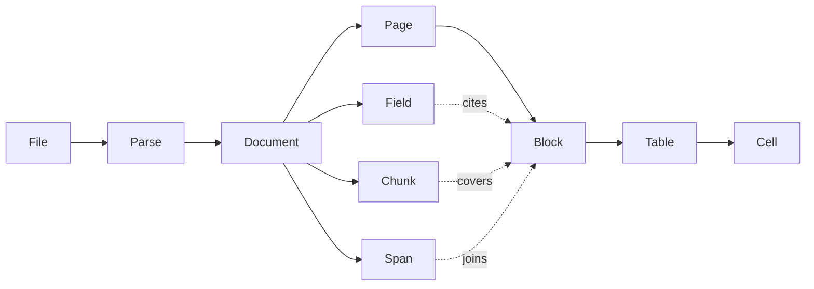

# Object model

## Overview

A parse turns one file into one document, and a document is a tree of
small objects a caller can address one at a time: a page, a block on
that page, a cell in a table, a field of an extraction. This spec names
those objects, their identifiers, their coordinates, and which store
holds each. Every other spec reads and writes these shapes.

## Current state

The earlier service had a layout model with pages, elements, table
cells and nineteen element kinds, and a reference scheme of
`page.order`. That model is carried over with four changes: boxes are
normalized instead of being in points or pixels depending on the
source, the confidence field that nothing ever set is removed, page
images leave the document, and a block's kind set is cut to what a
reader is asked to produce. The public Go package is `document`.

## Design

### The objects



| Object | What it is | Identifier |
|---|---|---|
| File | a source snapshot: bytes with a size, a SHA-256, a detected media type, a name, and an optional origin | `fil_` + 26 characters |
| Parse | one request to turn a file into a document: options, state, progress, usage | `prs_` + 26 characters |
| Document | the result of a parse | the parse's id |
| Page | one page, sheet, slide or image frame, in source order | its number, from 1 |
| Block | one region of a page with one kind | `ref`: `<page>.<order>` |
| Table | the structure of a block of kind `table` | the block's `ref` |
| Cell | one cell of a table | `<page>.<order>.<row>.<col>` |
| Span | a table that continues across pages, as a join of blocks | `s<n>` |
| Field | one extraction result for one named schema | the schema's name |
| Chunk | a run of blocks rendered as text, for retrieval | `c<n>` |

Identifiers with a prefix are ULIDs, so they sort by creation time. A
`ref` is stable for the life of the parse: a retry that re-reads a page
replaces that page's blocks and their refs together.

### Page

```json
{
  "number": 3,
  "width": 595.0, "height": 842.0, "rotation": 0,
  "state": "succeeded",
  "source": "reader",
  "reader": "default", "model": "gemini-3-flash",
  "attempts": 1,
  "blocks": [ ... ]
}
```

`width` and `height` are in points (1/72 inch) for paged formats and in
pixels for images. `source` is `reader` when a model read the page and
`native` when the format carried its own structure ([[009-intake]]).
`state` is `pending`, `succeeded` or `failed`; a failed page has an
`error` and no blocks.

### Block

```json
{
  "ref": "3.4",
  "kind": "table",
  "order": 4,
  "box": [0.08, 0.31, 0.92, 0.58],
  "text": "Quarter | Revenue ...",
  "level": null,
  "table": { "rows": 6, "cols": 3, "cells": [ ... ], "html": "<table>...</table>" },
  "repeated": false
}
```

- `kind` is one of: `title`, `heading`, `text`, `list_item`, `table`,
  `figure`, `formula`, `form`, `key_value`, `caption`, `footnote`,
  `page_header`, `page_footer`, `page_number`, `signature`, `barcode`,
  `code`. A label a reader returns outside this set becomes `text`.
  The set is closed: adding a kind is a change to this spec.
- `order` is the reading order within the page, dense from 1. Reading
  order across pages is page order.
- `box` is `[x0, y0, x1, y1]` as fractions of the page's width and
  height, origin at the top left, `x0 < x1` and `y0 < y1`. A block with
  no known position, which is every block of a `native` page, has
  `"box": null`. One coordinate system for every source is what lets a
  client draw an overlay without knowing how the page was rendered.
- `text` is the block's content as plain text. For a table it is the
  cells joined row by row; for a figure it is the reader's description.
- `level` is the heading depth, 1 to 6, on `title` and `heading`.
- `repeated` marks a running header or footer found by
  [[010-assembly]]. It is rendered once.
- There is no confidence value. A reader does not return one that can
  be compared across models, and a field that is always absent or
  always wrong is worse than none. What a block does carry is `flags`,
  set by validation ([[008-readers]]): `box_clamped`, `kind_coerced`,
  `truncated`.

### Table

`cells` is a list of `{row, col, row_span, col_span, text, box}`. `html`
is the reader's or the native extractor's table markup, kept verbatim
because it is the one form that carries merged cells without loss.
Markdown is rendered from the cells on request, never stored.

### Span, Field, Chunk

- A Span is `{"id": "s1", "parts": ["3.4", "4.1"], "rows": 41, "cols": 3}`.
  The per-page tables stay as they are; a span adds the join.
- A Field is `{"name", "data", "citations", "model", "attempts"}`, where
  `citations` maps a JSON pointer into `data` to a list of block refs
  ([[011-structured-extraction]]).
- A Chunk is `{"id", "text", "pages", "blocks"}`.

### Where each is stored

| Data | Store | Key or table |
|---|---|---|
| File metadata, parse state, progress, usage | Postgres | `files`, `parses` |
| Tasks, leases, queue accounting, pools | Postgres | [[004-durable-tasks]], [[006-fairness-and-priority]], [[007-model-capacity]] |
| Source snapshot | object store | `sources/<owner key>/<sha256>`, the owner key a hash of the owner ([[014-sources-and-retention]]) |
| Working copy after conversion | object store | `parses/<parse>/work/source.<ext>` |
| Page image | object store | `parses/<parse>/pages/<n>.png`, raw image bytes |
| Page result | object store | `parses/<parse>/pages/<n>.json` |
| Document index | object store | `parses/<parse>/document.json`: page list, spans, outline, usage, without blocks |
| Renderings | object store | `parses/<parse>/document.md`, `document.txt` |
| Field | object store | `parses/<parse>/fields/<name>.json` |
| Chunks | object store | `parses/<parse>/chunks.jsonl` |

The page is the unit of storage and the block is the unit of
addressing. A block is not a database row: a 3,000-page document has
on the order of a hundred thousand blocks, they are written once and
read by page, and a row per block would put the largest table in the
system behind every claim query for no read it serves. The API
resolves a block ref by reading its page object ([[003-api]]).

Every key is deterministic from the parse id and the page number, so a
task that runs twice writes the same key with the same meaning
([[004-durable-tasks]]). An image is stored as image bytes, never as
base64 inside JSON.

## Not in this spec

How blocks are produced ([[008-readers]], [[009-intake]]), how spans and
`repeated` are computed ([[010-assembly]]), the HTTP shapes that return
these objects ([[003-api]]), and retention ([[014-sources-and-retention]]).

## Acceptance criteria

| Criterion | Proven by |
|---|---|
| The `document` package round-trips every object through JSON without loss, and rejects a box outside `[0,1]`, an inverted box, an unknown kind, and a duplicate ref | unit tests over golden files |
| A block ref resolves to the same block before and after assembly, and after a retry that did not re-read its page | an end-to-end test |
| A page from a PDF, an image and a spreadsheet all satisfy one schema; only `box` and `source` differ | a schema test over fixtures of each |
| No object written to Postgres exceeds 64 KiB, and no page image is ever written to Postgres | a store test that parses the largest fixture and inspects row sizes |
| Writing a page result twice yields one object with the second content | a store conformance test run against the memory and the S3 implementations |
