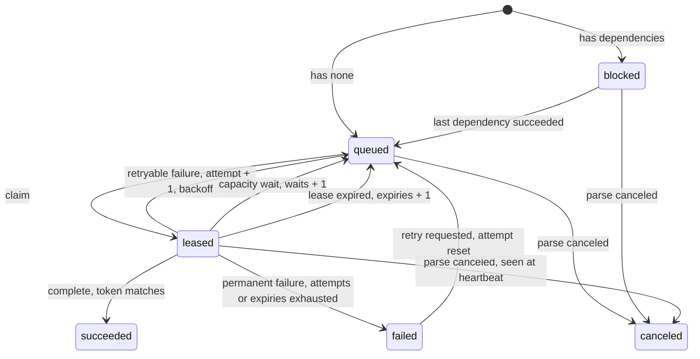

# Durable tasks

## Overview

Every unit of work Lectio does is a task: a row in Postgres that a
worker claims under a lease, runs, and settles. This spec defines the
row, the claim, what a lease guarantees, how a task is retried, how
waiting differs from failing, and how a dead worker's tasks come back.
It is the mechanism under invariants 1, 2, 3, 5 and 6 of
[[001-architecture]]. Which task a worker claims next is
[[006-fairness-and-priority]]; what the tasks of a parse are is
[[005-parse-graph]].

## Current state

The earlier service had no task table. A parse lived in the memory of
the replica that accepted it and ran as one unit, so a restart replayed
every unfinished parse from its first page, a second replica replayed
parses the first was still running, a document that crashed the process
was re-queued on every start, and a cancel changed a row while the work
went on. None of that is carried over. The state names and the retry
package from the shared library are.

## Design

### The row

```sql
CREATE TABLE tasks (
  parse_id         text    NOT NULL REFERENCES parses ON DELETE CASCADE,
  task_id          text    NOT NULL,           -- prepare | page-<n> | assemble | extract-<name> | finalize
  kind             text    NOT NULL,
  group_id         text    NOT NULL,
  class            smallint NOT NULL,          -- 0 interactive, 1 batch
  priority         integer NOT NULL DEFAULT 0,
  seq              integer NOT NULL,           -- position within the parse; orders a group's queue
  cost             integer NOT NULL,           -- fairness charge; 1 for a page, 0 otherwise
  state            text    NOT NULL,           -- blocked | queued | leased | succeeded | failed | canceled
  blocked_by       integer NOT NULL DEFAULT 0, -- unsettled dependencies
  attempt          integer NOT NULL DEFAULT 0,
  expiries         integer NOT NULL DEFAULT 0,
  waits            integer NOT NULL DEFAULT 0,
  available_at     timestamptz NOT NULL DEFAULT now(),
  reader           text,                       -- the pool a leased page task holds a slot in
  lease_owner      text,
  lease_token      bigint  NOT NULL DEFAULT 0,
  lease_expires_at timestamptz,
  error            jsonb,
  created_at       timestamptz NOT NULL DEFAULT now(),
  settled_at       timestamptz,
  PRIMARY KEY (parse_id, task_id)
);
CREATE INDEX tasks_runnable ON tasks (group_id, class, priority DESC, seq, created_at)
  WHERE state = 'queued';
CREATE INDEX tasks_leased ON tasks (lease_expires_at) WHERE state = 'leased';
CREATE TABLE task_edges (parse_id text, task_id text, needs text, PRIMARY KEY (parse_id, task_id, needs));
```

Task ids are deterministic from the parse, so writing a parse's tasks
twice is `ON CONFLICT DO NOTHING` and writes nothing the second time.

### States



### Claim

One transaction, on the pooled endpoint:

1. Pick a group and a class ([[006-fairness-and-priority]]).
2. `SELECT ... FROM tasks WHERE group_id = $1 AND class = $2 AND state = 'queued' AND available_at <= now() ORDER BY priority DESC, seq, created_at FOR UPDATE SKIP LOCKED LIMIT 1`.
3. For a page task, take a slot in a reader pool or stop
   ([[007-model-capacity]]).
4. `UPDATE` the row to `leased`, set `lease_owner`, increment
   `lease_token`, set `lease_expires_at = now() + lease`.

The worker receives the task and the token. Every timestamp in this
spec is the database's `now()`; a worker's clock is never compared with
a stored time.

### Lease, heartbeat, fencing

| Setting | Default |
|---|---|
| `LECTIO_TASK_LEASE` | 60s |
| heartbeat interval | lease / 3 |
| `LECTIO_WORKER_POLL` | 1s idle, backing off to 5s with jitter |
| `LECTIO_SWEEP_INTERVAL` | 30s |

A heartbeat is `UPDATE tasks SET lease_expires_at = now() + lease WHERE
... AND lease_token = $token AND state = 'leased' RETURNING
(SELECT cancel_requested FROM parses ...)`. Zero rows means the lease is
gone: the worker abandons the task and writes nothing further. A
returned cancel flag makes the worker cancel the task's context, which
aborts the model call in flight.

Completion is one transaction: the same predicate on `lease_token`,
the row to `succeeded`, each dependent's `blocked_by` decremented and
moved to `queued` at zero, and the parse's progress counters advanced.
A worker whose lease expired and was reissued matches no row and is
refused. This is the fence: two workers may briefly run one task, and
only the holder of the current token can settle it.

A task's output is written to its deterministic object key before
completion ([[002-object-model]]). If the worker dies between the write
and the completion, the next holder overwrites the same key with an
equivalent result. Effects outside the object store and the database,
of which the reader call is the only one, are the reason a page may be
read twice after a crash; it is never recorded twice.

### Failure, and what is not failure

A task ends an attempt in one of four ways:

| Outcome | Examples | Effect |
|---|---|---|
| retryable failure | a network error, a 5xx from the model endpoint, a timeout, a reply that fails validation | `attempt + 1`; `available_at = now() + backoff(attempt)`; `failed` at `LECTIO_TASK_ATTEMPTS` (default 5) |
| permanent failure | a 4xx other than 408 and 429, a corrupt page, an unsupported input, a budget refusal | `failed` at once |
| capacity wait | the pool is full, the pool is paused by a rate limit, the breaker is open | `waits + 1`; `available_at` set to when the pool expects room; `attempt` unchanged |
| lease expiry | the worker died or stalled | `expiries + 1`; `attempt` unchanged; `failed` at `LECTIO_TASK_EXPIRIES` (default 3) |

Backoff is `min(cap, base * 2^(attempt-1))` with `base` 1s and `cap`
60s, plus jitter uniform in half the delay. A capacity wait is bounded
by the parse's deadline, not by a count: under sustained contention a
page waits, and it does not die without one real failure. The expiry
bound exists for the opposite case: an input that kills the worker
every time it is touched stops after three workers, instead of being
handed to every worker forever.

### Sweeps

Any worker runs the sweeps; each is a single statement that is safe to
run concurrently.

- **Expired leases**: `UPDATE tasks SET state = 'queued', expiries =
  expiries + 1, lease_owner = NULL, reader = NULL WHERE state = 'leased'
  AND lease_expires_at < now()`, with the `failed` branch for rows at
  the expiry bound.
- **Deadlines**: a parse past its deadline is failed with
  `deadline_exceeded` and its unsettled tasks canceled.
- **Settled tasks**: rows of a terminal parse older than
  `LECTIO_TASK_RETENTION` (default 7 days) are deleted; the parse row
  keeps the counters a reader needs.
- Retention sweeps for files and parses are [[014-sources-and-retention]].

### Cancel

`POST /parses/{parse}/cancel` sets `cancel_requested` on the parse and,
in the same transaction, moves its `blocked` and `queued` tasks to
`canceled`. Leased tasks learn at their next heartbeat. The parse
becomes `canceled` when no task of it is leased. Results already
written stay readable until the parse is deleted.

### Behind a connection pooler

Every operation above is one short transaction with no session state,
so a transaction-mode pooler can sit in front of it. Lectio uses no
`LISTEN` or `NOTIFY`, no session advisory lock, and no named prepared
statement; workers poll. Where a critical section is needed
([[007-model-capacity]]) it is `pg_advisory_xact_lock`, which ends with
the transaction. Migrations run on a separate direct connection.
JSON parameters are bound as text.

### Shutdown

On a termination signal a worker stops claiming, lets running tasks
finish for `LECTIO_SHUTDOWN_GRACE` (default 25s), then cancels them and
releases their leases explicitly (`state = 'queued'`, no counter
changed), so a rolling restart costs neither an attempt nor a lease
period.

## Not in this spec

Which group's task is claimed ([[006-fairness-and-priority]]); pool
slots, rate limits and the breaker ([[007-model-capacity]]); the tasks
of a parse and their edges ([[005-parse-graph]]). A general workflow
engine: tasks here have one shape and one owner.

## Acceptance criteria

| Criterion | Proven by |
|---|---|
| A worker killed with `SIGKILL` while holding a task loses it after one lease period, another worker completes it, and `attempt` is unchanged | a process-level test |
| A worker paused past its lease and resumed cannot complete or heartbeat its task | a test that suspends a worker and asserts the refused write |
| Across 1,000 parses run by 8 workers with random kills, every task settles exactly once and no page result is missing | a soak test over Postgres |
| A pool that refuses every call for longer than `LECTIO_TASK_ATTEMPTS` backoffs leaves `attempt` at 0 and the task queued | a test with a stub pool |
| An input that crashes the worker is failed after `LECTIO_TASK_EXPIRIES` leases with code `page_unreadable`, and the rest of the parse completes | a test with a stub reader that exits the process |
| A graceful shutdown returns leased tasks to the queue within the grace period with no counter changed | a test sending `SIGTERM` |
| Every statement runs unchanged through a transaction-mode pooler | the store conformance suite run through PgBouncer in transaction mode |
| The claim query uses `tasks_runnable` and stays under 5 ms at one million queued rows | a benchmark with `EXPLAIN` assertions |
