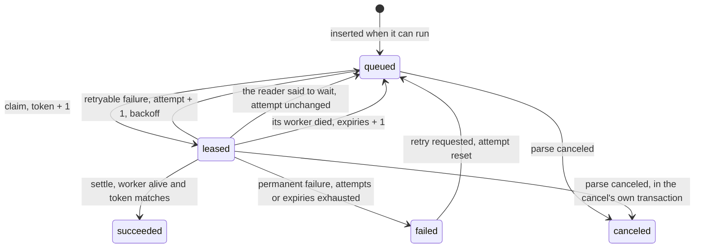

# Durable tasks

## Overview

Every unit of work Lectio does is a task: a row in Postgres that a
worker claims, runs, and settles. This spec defines the row, the lease
a worker process holds for the tasks it runs, the one call a worker
makes to the database, what the fencing token guarantees, how a task is
retried, and how a dead worker's tasks come back. It is the mechanism
under invariants 1, 2, 3, 5 and 6 of [[001-architecture]]. Which task a
worker claims next is [[006-fairness-and-priority]]; whether a model
has room for it is [[007-model-capacity]]; what the tasks of a parse
are is [[005-parse-graph]].

## Current state

The earlier service had no task table. A parse lived in the memory of
the replica that accepted it and ran as one unit, so a restart replayed
every unfinished parse from its first page, a second replica replayed
parses the first was still running, a document that crashed the process
was re-queued on every start, and a cancel changed a row while the work
went on. None of that is carried over. The state names and the retry
package from the shared library are.

### What changed in review

The first draft of this spec made the task row the unit of everything
at once: the lease, the pool slot, the fairness charge, the meter and
the trace span. Each was reasonable alone. Together they put about
16 database round trips on every page, a heartbeat on every task,
and a write on every poll that found no capacity, against a deployment
that may give this service one database connection. They also tied a
page's survival to the database answering within one task lease: a
stall of a minute expired every live lease, and a page caught in three
stalls failed as unreadable.

The row stays the unit of work and of the fencing token. The lease
moves to the worker process, and a worker talks to the database once
per interval, not once per page. Four defects of the draft are closed
with it: a cancel was not fenced, the fence did not cover the object
store, a capacity wait was a write, and the graph kept edge rows it did
not need.

## Design

### The rows

```sql
CREATE TABLE workers (
  worker_id  text PRIMARY KEY,                 -- minted at process start, never reused
  seen_at    timestamptz NOT NULL DEFAULT now(),
  expires_at timestamptz NOT NULL              -- seen_at + LECTIO_TASK_LEASE
);

CREATE TABLE tasks (
  parse_id      text     NOT NULL REFERENCES parses ON DELETE CASCADE,
  task_id       text     NOT NULL,             -- prepare | page-<n> | assemble | extract-<name>
  kind          text     NOT NULL,
  group_id      text     NOT NULL,
  project_id    text     NOT NULL DEFAULT '',  -- the group's project; '' is its own
  class         smallint NOT NULL,             -- 0 interactive, 1 batch
  priority      integer  NOT NULL DEFAULT 0,
  seq           integer  NOT NULL,             -- position within the parse; orders a project's queue
  pin           text,                          -- the reader the parse named, when it named one
  lane          text     NOT NULL GENERATED ALWAYS AS (
                  CASE WHEN kind IN ('prepare', 'assemble') THEN ''
                       WHEN pin IS NULL THEN kind
                       ELSE kind || ':' || pin END) STORED, -- whose room the task waits for
  state         text     NOT NULL,             -- queued | leased | succeeded | failed | canceled
  attempt       integer  NOT NULL DEFAULT 0,
  expiries      integer  NOT NULL DEFAULT 0,
  available_at  timestamptz NOT NULL DEFAULT now(),
  lease_owner   text,                          -- the worker running it
  lease_token   bigint   NOT NULL DEFAULT 0,   -- raised by one at every claim
  leased_at     timestamptz,
  reader        text,                          -- the pool the task holds a slot in
  scope         text,                          -- the key scope of that slot
  calling       boolean  NOT NULL DEFAULT false, -- holds the slot now
  charged       integer  NOT NULL DEFAULT 0,   -- fairness units charged at claim
  output        text,                          -- object key of the result that won
  calls         integer  NOT NULL DEFAULT 0,   -- model calls, over every attempt
  input_tokens  bigint   NOT NULL DEFAULT 0,
  output_tokens bigint   NOT NULL DEFAULT 0,
  error         jsonb,
  created_at    timestamptz NOT NULL DEFAULT now(),
  settled_at    timestamptz,
  PRIMARY KEY (parse_id, task_id)
);
CREATE INDEX tasks_runnable ON tasks (group_id, project_id, class, lane, priority DESC, seq, created_at, parse_id, task_id)
  WHERE state = 'queued';
CREATE INDEX tasks_leased ON tasks (lease_owner) WHERE state = 'leased';
CREATE INDEX tasks_slots  ON tasks (reader, scope) WHERE state = 'leased' AND calling;
```

Task ids are deterministic from the parse, so writing a parse's tasks
twice is `ON CONFLICT DO NOTHING` and writes nothing the second time.

`lane` names whose room a task waits for: nothing for a task that calls
no model, the kind for a task that follows the routing policy's chain,
and the kind with the reader for a task pinned to one. Room belongs to
a reader and a key ([[007-model-capacity]]), so the queued tasks of one
lane in one group have room together or have none. The claim decides
per lane and reads the first task of each lane that has room, one probe
of `tasks_runnable` each, so a task that cannot run is never read. An
index without the column orders a project's tasks with no regard to
room: a project whose first 100,000 tasks wait for a paused reader
would be read row by row, on every claim, to find the one `assemble`
behind them, and a tenant in that state is the one the fair queue looks
at first. The parse and the task end the index key so that tasks equal
in priority, `seq` and age are taken in one fixed order.

There is no table of edges and no `blocked` state. The graph of a
parse is fixed ([[005-parse-graph]]), so the parse row counts its
unsettled page tasks in `pages_open`, and the settle that takes the
count to zero inserts the `assemble` task in the same transaction. A
task exists only when it can run.

### States



### The worker's lease

A worker process registers a row in `workers` when it starts and holds
one lease for everything it runs. A task is leased while three things
hold: its `state` is `leased`, its `lease_owner` is a worker whose row
is still there, and the token the worker was given equals
`lease_token`. A worker's row is removed by another worker's sweep once
its `expires_at` has passed (Sweeps, below) and by its own shutdown, so
a lease ends when the fleet acts on its expiry and not at the instant
itself. There is no expiry on the task row and no heartbeat per task.

| Setting | Default |
|---|---|
| `LECTIO_TASK_LEASE` | 60s, the length of a worker's lease |
| `LECTIO_WORKER_FLUSH` | 200ms, the shortest time between two exchanges of one worker |
| `LECTIO_WORKER_POLL` | 1s idle, backing off to 5s with jitter |
| `LECTIO_SWEEP_INTERVAL` | 30s |

Every timestamp in this spec is the database's `now()`; a worker's
clock is never compared with a stored time. Each function the store
calls takes an optional last argument that stands in for `now()`. Tests
pass it, to move leases, backoff, pauses and deadlines with a virtual
clock and no sleep; the server never does.

The values in the table, and the bounds, weights and reader chains of
this spec and the two that build on it, reach the database as one row,
`settings`, which a store writes when it opens. Every function reads
them there, so no statement carries configuration and the replicas of
one deployment apply the same values. The last store to open decides.

### The exchange

A worker makes one kind of call to the database. It is one statement,
a function in the database, so it is one round trip and one
transaction with no client time inside it. A worker calls it when a
task finished or a slot is free, at most once per `LECTIO_WORKER_FLUSH`
and at least once per third of the lease. In order, the exchange:

1. **Renews** the worker: `UPDATE workers SET seen_at = now(),
   expires_at = now() + lease WHERE worker_id = $1`. Zero rows means
   the fleet has given this process up: another worker found its lease
   expired, returned its tasks to the queue and removed its row. It
   abandons every task it runs, writes nothing further for them, and
   registers under a new id. The renewal does not test `expires_at`. A
   row that is past its expiry and still there was reaped by no one, so
   every task it holds is still its own. Refusing it would give up
   every worker at its first exchange after a stall of the database,
   with all the work in flight, which is what the reap rule under
   Sweeps exists to prevent.
2. **Settles** the tasks that finished since the last exchange, each
   under the fence below: the outcome, the output key, the usage of the
   attempt, the fairness correction ([[006-fairness-and-priority]]),
   the parse's progress counters, and for the last page of a parse the
   insert of `assemble`.
3. **Reports** which of the tasks the worker still runs are no longer
   its own: canceled, or reissued after the worker was taken for dead.
   The worker cancels those tasks' contexts, which aborts a model call
   in flight.
4. **Claims** up to as many tasks as the worker has free slots, chosen
   by the fair queue among tasks whose reader has room
   ([[006-fairness-and-priority]], [[007-model-capacity]]). Each claim
   sets `state = 'leased'`, `lease_owner`, `leased_at`, raises
   `lease_token`, and for a task that calls a model takes its slot.
5. **Takes and releases slots** for tasks that make more than one
   model call ([[007-model-capacity]]).

The whole exchange runs under one transaction-level advisory lock, so
exchanges are serialized across the fleet. This makes every count in
it exact, a pool's in-flight number and a group's running number
included, with no further lock, and it bounds the fleet to what one
lock passes: an exchange of a few milliseconds allows a few hundred per
second. That is the ceiling of this design, stated on purpose. Past it
the lock is split by class or by group, which changes no row.

The statement is `SELECT lectio_exchange($1, $2)`: the worker's id and
the request as one JSON document bound as text, answered by one JSON
document. The request names the settles, the tasks the worker still
holds, how many it can take, whether it runs nothing at all, and
whether this is its last exchange. The reply names the settles that
were refused, the held tasks that are no longer the worker's, the
claims, when the earliest pause ends among the scopes that had no room,
and whether the fleet gave the worker up. The function, and the
functions for register, submit and cancel beside it, are carried by a
migration.

### The statement budget

The number of statements depends on how many worker processes there
are and not on how fast pages are read. With 200 pages in flight on 25
processes of 8 slots, the fleet issues at most 25 exchanges per
`LECTIO_WORKER_FLUSH`, 125 per second, whether a page takes five
seconds or half a second, plus one sweep statement per sweep interval.
An idle worker backs off to one exchange every five seconds. At two
milliseconds per exchange that is a quarter of one database connection,
which is why the design holds behind a server-side pool of one.

A page's result is visible to a caller when its settle commits, so a
finished page waits at most one flush interval to be read. A worker
with a task that finished and no exchange in the last interval calls at
once.

### Fencing

A settle is `UPDATE tasks ... WHERE parse_id = $1 AND task_id = $2 AND
state = 'leased' AND lease_owner = $worker AND lease_token = $token`.
A worker that was taken for dead, a task that was reissued, and a task
that was canceled each match no row, and the settle is refused. Two
workers may briefly run one task; only the holder of the current token
on a live lease can settle it.

The fence covers the object store too. A model's replies to the same
page are not equivalent, so two workers that write one key would leave
blocks that disagree with the reader, the model and the usage the row
records. A task therefore writes its output to a key that carries its
token, `pages/<n>.<token>.json` for a page, and the settle records that
key in `output`. A stale worker's late write lands on a key that
nothing points at. The document index lists the winning key of every
page ([[005-parse-graph]]), so a result is found through the task row
while the parse runs and through the index after. Keys nothing points
at are removed by a sweep.

The reader call is the one effect outside the database and the object
store. A page may be read twice after a crash; it is never recorded
twice.

### Failure, and what is not failure

An attempt ends in one of four ways:

| Outcome | Examples | Effect |
|---|---|---|
| retryable failure | a network error, a 5xx from the model endpoint, a timeout, a reply that fails validation | `attempt + 1`; `available_at = now() + backoff(attempt)`; `failed` at `LECTIO_TASK_ATTEMPTS` (default 5) |
| permanent failure | a 4xx other than 408 and 429, a corrupt page, an unsupported input, a budget refusal | `failed` at once |
| the reader said to wait | a rate-limit reply from the endpoint | `attempt` unchanged; `available_at` set to when the pool's pause ends ([[007-model-capacity]]) |
| the worker died | the process was killed or stalled past its lease | `expiries + 1`; `attempt` unchanged; see below |

Backoff is `min(cap, base * 2^(attempt-1))` with `base` 1s and `cap`
60s, plus jitter uniform in half the delay.

Waiting for capacity is not an outcome and writes nothing. A task
whose reader has no room is not claimed: the claim reads the pools
first and chooses among tasks that can run. A worker with free slots
and nothing to claim sleeps until the earliest pause ends or its poll
interval passes. The only write a rate limit causes is the one reply
that reported it.

Nothing waits without bound. A parse submitted with no deadline takes
`LECTIO_MAX_DEADLINE` as its deadline, so a page that can never be
read, because its reader stays paused or its parse pinned a reader that
is gone, ends with the parse and not never.

### A task that kills its worker

When a worker dies, every task it ran comes back with `expiries + 1`,
though at most one of them killed it. So that the others are not
blamed, a task with `expiries > 0` is run alone: it is claimed only by
a worker that runs nothing else, and that worker claims nothing more
until it settles. A task whose worker dies while running it alone is
the cause, and at `LECTIO_TASK_EXPIRIES` (default 3) it is failed with
`page_unreadable`. An input that kills the process every time it is
touched stops after three workers, and the pages that shared a worker
with it lose one lease period and nothing else. The code is the task's
own: a `prepare` that ends its workers fails with `document_corrupt`,
since the file is what intake could not open, and an `assemble` or an
extraction with `internal`.

The worker says in each exchange whether it runs nothing at all, a task
it was told it lost included. A task with `expiries > 0` is claimed
only when it says so and the store holds no task leased to it, and it
is then the only claim of that exchange.

### Sweeps

Any worker runs the sweeps, inside its own exchange when one is due;
each is a single statement that is safe to run concurrently. A row per
sweep in `sweeps` holds when it last ran.

- **Dead workers**: tasks leased to a worker whose `expires_at` has
  passed go back to `queued` with `expiries + 1` and their slot
  cleared, with the `failed` branch for rows at the bound, and the
  worker's row is deleted. A worker reaps others only when its own
  previous exchange, or its registration, was within the last third of
  a lease. After
  the database itself was unreachable for longer than a lease, every
  worker's first exchange renews its own row and reaps no one, so a
  stall of the database expires nothing.
- **Deadlines**: a parse past its deadline is failed with
  `deadline_exceeded` and its unsettled tasks canceled, in the cancel's
  own statement.
- **Settled tasks**: the `succeeded` task rows of a parse are deleted
  when the parse settles; the parse row keeps the counters and the
  document index keeps the output keys. `failed` and `canceled` rows
  stay for `LECTIO_TASK_RETENTION` (default 7 days), which is what a
  retry and an operator read.
- **Orphaned outputs**: objects under a settled parse's prefix that its
  document index does not list are deleted.
- Retention sweeps for files and parses are [[014-sources-and-retention]].

### Row volume

The task table holds what is queued or running, plus failures. At a
sustained 40 pages a second in parses of 20 pages, that is the backlog
(bounded per group by `max_queued`, [[006-fairness-and-priority]]),
200 leased rows, and a week of failed rows: thousands to a few hundred
thousand rows, not the hundred million that keeping every settled page
row for a week would be. The meter is one row per parse and reader, not
one per page ([[013-limits-and-usage]]).

### Cancel

`POST /parses/{parse}/cancel` is one transaction: the parse becomes
`canceled`, and its `queued` and `leased` tasks become `canceled`. It
takes the lock the exchange takes, so a settle is wholly before a
cancel or wholly after it. The fence does the rest. A page that finishes after the cancel settles
against a row that is no longer `leased` and writes nothing, so nothing
is recorded after a cancel, and `assemble` is never inserted. The dead
worker sweep and the claim both read only `leased` and `queued` rows,
so a canceled parse's page is never reissued. A worker learns of the
cancel at its next exchange, within one flush interval while it has
work, and aborts the call; until then the call's slot is already free
for others, which is a short overshoot of the pool and not a leak.
Results already written stay readable until the parse is deleted.

### Behind a connection pooler

The exchange and each sweep are one statement with no session state,
so a transaction-mode pooler can sit in front of them. Lectio uses no
`LISTEN` or `NOTIFY`, no session advisory lock, and no named prepared
statement; workers poll. The one lock is `pg_advisory_xact_lock`, which
ends with the transaction. Migrations, which carry the exchange
function, run on a separate direct connection. JSON parameters are
bound as text.

### Shutdown

On a termination signal a worker stops claiming and lets running tasks
finish for `LECTIO_SHUTDOWN_GRACE` (default 25s). Its last exchange
settles what finished, returns the rest to `queued` with no counter
changed, and deletes its worker row, so a rolling restart costs neither
an attempt nor a lease period.

### What this leaves open for longer work

A task here is one model call, or a few. Two hooks keep room for a
kind of task that does more, such as a model working over a whole
document, without designing it: the fairness charge is corrected at
settle to what the task used ([[006-fairness-and-priority]]), and a
task that makes several model calls holds a pool slot per call and not
for its whole lease ([[007-model-capacity]]). What stays open is a task
that holds a worker for minutes: the lease, the grace period at
shutdown, and the rule that a page is the preemption point all assume
seconds.

## Not in this spec

Which group's task is claimed ([[006-fairness-and-priority]]); pool
slots, rate limits and the breaker ([[007-model-capacity]]); the tasks
of a parse ([[005-parse-graph]]). A general workflow engine: tasks
here have one shape and one owner.

## Implementation status

Built:

- `internal/tasks`: the protocol a worker and a store share. The kinds,
  states and classes of a task; a claim, a settle with its outcome and
  the reader's health, and the request and reply of the exchange; and
  the settings a store runs with, each default the one this spec, or
  [[006-fairness-and-priority]] or [[007-model-capacity]], gives.

- `internal/store/postgres/migrations`: the tables above, and the
  functions that are their only writers: `lectio_register`,
  `lectio_submit`, `lectio_cancel` and `lectio_exchange`, which renews,
  settles under the fence, reports, claims and runs the sweeps for dead
  workers and for deadlines, in that order, under one
  `pg_advisory_xact_lock`. Step 5 of the exchange, a slot taken and
  given back per call of a task that makes several, is not built: a
  task holds the slot of its claim until it settles. The sweeps for
  settled tasks past their retention and for orphaned outputs are not
  built.

Remaining: everything that runs. `internal/run`, the in-process runner,
still stands in for this spec in a development server: it holds the
page-level shape of the work, ordering by class and priority, retry by
the reader's error class, a rate limit that spends no attempt, cancel
and deadline, and it keeps its queue in memory, so nothing is durable,
no task is a row, and a restart loses every parse that had not ended.

## Acceptance criteria

| Criterion | Proven by |
|---|---|
| A worker killed with `SIGKILL` while running tasks loses them after one lease period, other workers complete them, and `attempt` is unchanged | a process-level test |
| A worker paused past its lease and resumed cannot settle any task it ran, and registers under a new id | a test that suspends a worker and asserts the refused settle |
| Two workers that ran the same page write two objects; the page's `output` names the one whose settle matched, the document index lists it, and the other is deleted by the orphan sweep | a test that reissues a task under a paused worker |
| A page whose call returns after its parse was canceled records nothing: no `output`, no progress, no `assemble` task; and the parse is `canceled` when the cancel returns | a test with a stub reader that blocks across a cancel |
| Across 1,000 parses run by 8 workers with random kills, every task settles exactly once and no page result is missing | a soak test over Postgres |
| With every pool full for ten minutes and 32 idle slots polling, no task row is written | a test counting writes with a stub pool |
| A parse with no deadline whose pinned reader never admits a call ends `failed` with `deadline_exceeded` at `LECTIO_MAX_DEADLINE` | a test with a virtual clock |
| An input that crashes the worker is failed after `LECTIO_TASK_EXPIRIES` workers with code `page_unreadable`; the seven pages that shared its first worker each have `expiries` 1 and succeed | a test with a stub reader that exits the process |
| The database made unreachable for two lease periods and restored: no task has `expiries` raised and no page is read twice | a test that blocks the database connection |
| A graceful shutdown returns leased tasks to the queue within the grace period with no counter changed | a test sending `SIGTERM` |
| Every statement runs unchanged through a transaction-mode pooler | the store conformance suite run through PgBouncer in transaction mode |
| 25 worker processes with 200 slots and a stub reader of one-second pages sustain 190 pages a second through one pooled backend connection, with at most 130 statements a second and no lease lost | a throughput test through a pooler with a pool of one |
| The claim inside an exchange uses `tasks_runnable` and stays under 5 ms at one million queued rows | a benchmark with `EXPLAIN` assertions |
