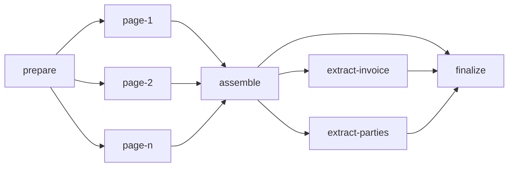

# Parse graph

## Overview

A parse is a small graph of tasks. This spec fixes its shape: which
tasks exist, what each reads and writes, which edges join them, and how
the parse's state follows from theirs. The unit that matters is the
page task. It is the unit of scheduling, of fairness, of retry and of
progress, which is what lets a 2-page parse finish while a 3,000-page
parse from the same tenant is still running, and lets a restart cost at
most the pages that were in flight.

## Current state

The earlier service ran a pipeline of stages (intake, recognition,
extraction, formatting) over a state envelope, in one process, as one
unit. The stage code is carried over as the bodies of the tasks below.
The envelope is not: state passes between tasks through the object
store, and no task receives another's memory.

## Design

### The graph



| Task | Reads | Writes | Cost | Calls a model |
|---|---|---|---|---|
| `prepare` | the source | the working copy, the manifest, the page and later tasks | 0 | no |
| `page-<n>` | the working copy, the manifest | `pages/<n>.png`, `pages/<n>.json` | 1 | once, unless the page is native |
| `assemble` | every page result | `document.json`, renderings, chunks | 0 | no |
| `extract-<name>` | the document | `fields/<name>.json` | 0 | yes, a text model |
| `finalize` | task rows | usage rows, the parse's terminal state | 0 | no |

`cost` is what the fair queue charges the tenant
([[006-fairness-and-priority]]): pages are the work, and the tasks
around them are free to schedule so that a parse is never stuck behind
its own tenant's backlog just to be assembled.

### prepare

`prepare` is the only task that exists at submit. It runs intake
([[009-intake]]): snapshot the source if it is a URL, detect the type,
unwrap and convert, count the pages, apply the page selection and the
limits. It then writes the manifest,

```json
{ "media_type": "application/pdf", "pages_total": 120, "selected": [1,2,3,7],
  "page_source": "render", "working_copy": "parses/<parse>/work/source.pdf" }
```

and, in one transaction, the rest of the graph: one `page-<n>` task per
selected page with `seq` equal to its position in the selection, then
`assemble`, the `extract-*` tasks and `finalize` in state `blocked`
with their edges. Writing all page rows at once is deliberate: three
thousand rows are small for the database, the queue's order within a
tenant interleaves parses by `seq` so no cursor is needed, and the
parse's total is known to progress from the first moment.

`prepare` does not render pages. Each page task renders its own page
from the working copy, so no step ever holds more than one page image
and a retry of `prepare` repeats no rendering.

### page

A page task fetches the working copy into a size-bounded cache on the
worker's local disk, keyed by content hash, and then either

- copies the page's blocks from the native extraction, when the format
  carried its own structure, or
- renders the page to an image, calls the reader the policy chose
  ([[008-readers]]), validates the reply, and normalizes the blocks.

It writes the page result and completes. The page is readable through
the API from that moment ([[003-api]]). A page task that exhausts its
attempts writes a page result with `state: failed` and its error, and
settles as `failed`.

### When pages fail

`assemble` is blocked by page tasks being settled, not by their
success: a `failed` page releases its dependents as a `succeeded` one
does. The document then lists that page as failed and has no blocks
for it. `finalize` sets the parse to `succeeded` when every page
succeeded and to `failed` with `page_unreadable` and the list of pages
otherwise. Either way everything that was read is kept and readable,
and `POST /parses/{parse}/retry` re-queues only the failed pages and
the tasks downstream of them. Work a tenant paid for is never
discarded because a later page failed.

A failed `prepare`, `assemble` or `finalize` fails the parse. A failed
`extract-<name>` fails the parse only when that schema was submitted
with `required: true` ([[011-structured-extraction]]).

### Parse state from task state

| Parse | When |
|---|---|
| `queued` | no task has been leased yet |
| `running` | any task has been leased and `finalize` has not settled |
| `succeeded`, `failed` | set by `finalize`, or by a failed `prepare` or `assemble` |
| `canceled` | cancel was requested and no task is leased |

`progress.stage` is derived from which task kinds are unsettled, and
`pages_done` and `pages_failed` are counters advanced in the completing
transaction ([[004-durable-tasks]]), so reading progress is one row.

### Reuse

Before any work, submit looks for a succeeded parse with the same
owner, the same source content hash and the same options fingerprint
(page selection, reader pin, output and extraction options, and the
routing policy's version). When `reuse` is true and one exists, it is
returned. The lookup is an index on `parses (owner, content_sha256,
options_fp)`; no separate table holds it.

## Not in this spec

Spans of several pages in one task. A page per task is the first
version; a reader that takes several pages in one call is a later
change to the manifest and to `cost`, not to the graph. Tasks that
loop or branch on quality: escalation happens inside a page task
([[008-readers]]).

## Acceptance criteria

| Criterion | Proven by |
|---|---|
| A parse of n selected pages writes exactly n page tasks plus the fixed tasks, and running `prepare` twice writes nothing more | a store test |
| With one worker killed after k pages, the completed parse made exactly n reader calls plus at most the number of tasks in flight at the kill | an end-to-end test with a counting stub reader |
| A parse with one unreadable page ends `failed`, returns the other pages and a document that marks the missing one, and after `retry` with a working reader ends `succeeded` having read one page | an end-to-end test |
| Two parses of one tenant, 300 pages and 2 pages, submitted in that order to one worker: the 2-page parse finishes before the 300-page parse reaches page 10 | a dispatch test |
| A second submit of the same content and options returns the first parse with `reused: true` and creates no task | an API test |
| Peak worker memory for a 500-page parse is within 10% of the peak for a 5-page parse of the same page size | a memory test |
