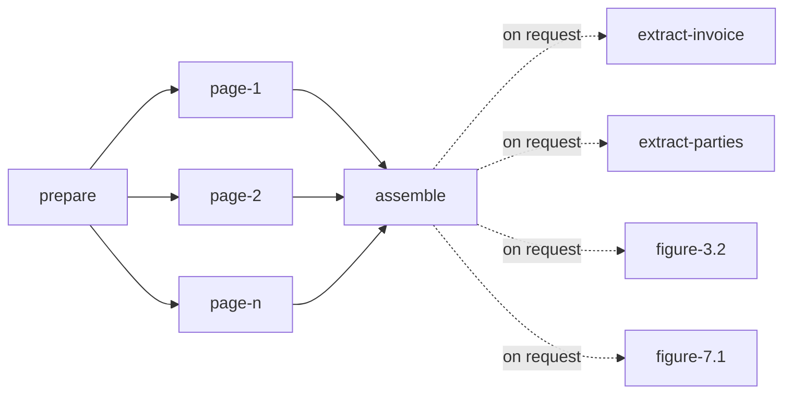

# Parse graph

## Overview

A parse is a small graph of tasks. This spec fixes its shape: which
tasks exist, what each reads and writes, when each comes to exist, and
how the parse's state follows from theirs. The unit that matters is the
page task. It is the unit of scheduling, of fairness, of retry and of
progress, which is what lets a 2-page parse finish while a 3,000-page
parse from the same tenant is still running, and lets a restart cost at
most the pages that were in flight.

## Current state

The earlier service ran a pipeline of stages (intake, recognition,
extraction, formatting) over a state envelope, in one process, as one
unit. The stage code is carried over as the bodies of the tasks below.
The envelope is not: state passes between tasks through the object
store, and no task receives another's memory.

### What changed in review

The first draft of this spec had five kinds of task joined by edge
rows, three of them free to the fair queue. The graph is fixed, so the
edges bought nothing a counter does not: `assemble` now comes to exist
when the last page settles, and `finalize` is no longer a task but the
end of `assemble`'s settle. A page of a format that carries its own
structure was a task that waited for a reader it never called; such
pages are now written by `prepare`. Every task that is dispatched is
charged ([[006-fairness-and-priority]]). And two things the draft
promised without a mechanism now have one: nothing is recorded after a
cancel, and a page's stored result is the one its row says was read.

## Design

### The graph



| Task | Reads | Writes | Charge | Calls a model |
|---|---|---|---|---|
| `prepare` | the source | the working copy, the manifest, the pages of a native format, the page tasks | 1 | no |
| `page-<n>` | the working copy, the manifest | the page's image and its result | its reader's `cost` | once, unless the page is blank |
| `assemble` | every page result | the document index, and the page results whose running headers and footers it marked | 1 | no |
| `extract-<name>` | the document | the field | its reader's `cost` per call | yes, a text model, once per window and per repair |
| `figure-<ref>` | the figure's page and its image | the figure's description | its describer's `cost` | once, unless a description of the same figure was kept |

An `extract-<name>` task is not part of what a submit creates. It is
added when a caller asks for a field ([[011-structured-extraction]]),
needs only a parse that has ended, and holds nothing else back: a parse
ends whether or not anyone asks it a question, and a question asked
later reads no page again. It takes a slot in its reader's pool for
each call it makes and is charged for each ([[007-model-capacity]]): it
makes one call a claim, and returns to the queue between 2 of them with
what it has so far ([[004-durable-tasks]]).

A `figure-<ref>` task is added the same way, by a request to describe
the figures of a parse that has ended ([[003-api]]): one task a figure,
written with the run in one transaction. It cuts the figure from the
image of its page and has a describer say what it shows.

Neither is an edge of the graph, and neither moves the parse. A field
asked while the parse runs is a row with no task, and the transaction
that ends the parse, by `assemble`, by a cancel or by its deadline,
queues it. A parse that ended without `assemble` has no index: its
extraction reads the pages its task rows name, as a read of its
document does. Both are tasks in the parse's group and project, in its
class and at its priority. An extraction sits behind the parse's own
`prepare` and `assemble` and ahead of the group's pages of that
priority, and the figures of a run take the order of the run, beside
the pages of other parses.

The charge is what the fair queue adds to the tenant's virtual time
([[006-fairness-and-priority]]). No task is free. `prepare` and
`assemble` are ordered ahead of the same tenant's pages, so a parse is
never stuck behind its own tenant's backlog just to be assembled, and
they are charged like any task so that a tenant cannot be served
without advancing.

### prepare

`prepare` is the only task that exists at submit. It runs intake
([[009-intake]]): snapshot the source if it is a URL, detect the type,
unwrap and convert, count the pages, apply the page selection and the
limits, and reserve the pages against the group's daily budget
([[013-limits-and-usage]]). It then writes the manifest,

```json
{ "media_type": "application/pdf", "pages_total": 120, "selected": [1,2,3,7],
  "source": "reader" }
```

where `media_type` is what the working copy is after any container was
opened and any conversion done, and `source` says who produces the
pages' blocks, `reader` or `native`. The durable manifest also names
the working copy's key, `parses/<parse>/work/source.<ext>`.

What `prepare` writes next depends on `source`, in one transaction
with its own settle:

- **`reader`**: one `page-<n>` task per selected page, `queued`, with
  `seq` equal to its position in the selection, and the parse's
  `pages_open` set to their number. Writing all page rows at once is
  deliberate: three thousand rows are small for the database, the
  queue's order within a tenant interleaves parses by `seq` so no
  cursor is needed, and the parse's total is known to progress from the
  first moment.
- **`native`**: no page task. The pages exist as soon as the file was
  read, so `prepare` writes their results and inserts `assemble`. A
  3,000-sheet workbook is not 3,000 tasks waiting for a reader none of
  them calls.

`assemble` is not written with the pages. It has no row until it can
run ([[004-durable-tasks]]).

`prepare` does not render pages. Each page task renders its own page
from the working copy, so no step ever holds more than one page image
and a retry of `prepare` repeats no rendering.

### page

A page task fetches the working copy into a size-bounded cache on the
worker's local disk, keyed by content hash, renders the page to an
image, calls the reader it was claimed for ([[008-readers]]), validates
the reply, and numbers the blocks. A rendered page with nothing on it
is written as a succeeded page with no blocks and no reader is called;
its charge is corrected at settle to the floor of one unit
([[006-fairness-and-priority]]).

A page task writes its image and its result to keys that carry its
lease token, `pages/<n>.<token>.png` and `pages/<n>.<token>.json`, and
its settle records the result's key on its row
([[004-durable-tasks]]). Two workers that ran the same page after a
crash wrote two results; the row names the one whose settle was
accepted, and that is the one a caller reads. The page is readable
through the API from the moment its settle commits ([[003-api]]). A
page task that exhausts its attempts writes a page result with `state:
failed` and its error, and settles as `failed`.

What a page task does next follows from the class of the reader's
error ([[008-readers]]), never from a status code:

| The reader's error | The page task | The page's error when it gives up |
|---|---|---|
| rate limited | ends the attempt as a wait, spends no attempt, and is claimed again when its reader has room | `deadline_exceeded` on the parse, only when the limit never lifts |
| retryable | spends an attempt, waits a backoff, tries again | `reader_unavailable` |
| invalid | spends an attempt; the second invalid reply sends the page once to the next reader in the chain, which gets attempts of its own; a pinned parse stays with its reader | `page_unreadable` |
| budget | fails the page at once | `budget_exhausted` |
| permanent | fails the page at once: this reader cannot take the page as it is | `page_unreadable` |
| refused | the reader is healthy and declined this page: the page goes to the next reader in the chain, with no limit on how far, and is not tried again where it was declined; a pinned parse has no next reader | `page_unreadable` |
| misconfigured | the endpoint rejected the request itself, as it will for every page: the page goes to the next reader in the chain, and the failure counts against the reader's breaker | `reader_unavailable` |

A failure of the file itself, such as a page that cannot be rendered,
is not the reader's: no other attempt or reader changes it, and the
page fails at once with the file's own code.

### assemble, and the end of a parse

The settle of a page decrements the parse's `pages_open`, and the
settle that takes it to zero inserts `assemble` in the same
transaction. Pages are counted as they settle, not as they succeed: a
`failed` page releases `assemble` as a `succeeded` one does.

`assemble` reads every page result by the key its row recorded, runs
the passes of [[010-assembly]], and writes the document index under its
own token. The index lists, for every page, its state and the key of
its result, so a page is found through its task row while the parse
runs and through the index after. The document then lists a failed
page as failed and has no blocks for it.

There is no `finalize` task. The settle of `assemble` ends the parse
in the same transaction: it records the index's key on the parse, sets
the parse to `succeeded` when the number of failed pages is at most the
submit's `allow_failed_pages`, which is 0 unless the caller raised it,
and to `failed` with the count of pages otherwise, and refunds the
pages that were reserved and not read ([[013-limits-and-usage]]). What
the tasks used is in the meter already: each settle wrote it.

The parse's own error follows its pages. When every failed page carries
the same code, the parse fails with that code: one whose failed pages
were all refused for budget fails with `budget_exhausted`, and one
whose reader could not be reached with `reader_unavailable`, so a
caller reads from the parse alone whether reading it again can help.
When the failed pages carry several codes the parse fails with
`page_unreadable`.

A parse that ends with every page read keeps no task row: its counters
are on its own row and its output keys in the index. One that ends with
a failed page keeps every row ([[004-durable-tasks]]). Either way
everything that was read is kept and readable, and `POST
/parses/{parse}/retry` re-queues only the failed pages, sets
`pages_open` to their number, and lets `assemble` run again when they
settle, over the pages that were read before and the pages read now.
Work a tenant paid for is never discarded because a later page failed.

A failed `prepare` or `assemble` fails the parse. A failed
`extract-<name>` fails its field and leaves the parse as it was
([[011-structured-extraction]]), and a failed `figure-<ref>` is a
figure its run lost ([[003-api]]). The table of reader errors above
holds for both with their own codes: where a page gives up with
`page_unreadable`, a figure gives up with `figure_unreadable` and an
extraction with `schema_not_satisfied`.

### The steps as code

The work of a parse is two functions in `internal/parse` that hold no
state between calls. `Prepare` runs once per file: it tells what the
file is, opens and converts what needs it, counts the pages, selects
the ones to read, and returns the manifest, the working copy, and the
pages of a native format. `ReadPage` runs once per page: it renders
that page, has a reader read it, checks the answer, and numbers the
blocks. Neither knows about queues, tenants or storage, so whoever
schedules them, in one process or across many, can run pages in any
order, retry one without the others, and stop between any two.

### Parse state from task state

| Parse | When |
|---|---|
| `queued` | no task has been leased yet |
| `running` | a task has been leased and the parse has not ended; a retry returns a parse that ended to it |
| `succeeded`, `failed` | set by the settle of `assemble`, or by a failed `prepare` |
| `failed` with `deadline_exceeded` | the deadline passed before `assemble` settled |
| `canceled` | set by the cancel itself, in its own transaction |

A cancel moves the parse and its `queued` and `leased` tasks to
`canceled` at once ([[004-durable-tasks]]). A page that was being read
when the cancel arrived finishes against a row that is no longer
leased, so its settle is refused: its result is not recorded, progress
does not advance, and `assemble` is never inserted. Nothing is written
after a cancel. What was read before it stays readable.

`progress.stage` is derived from which task kinds are unsettled, and
`pages_done` and `pages_failed` are counters advanced in the settling
transaction ([[004-durable-tasks]]), so reading progress is one row.

### Reuse

Reuse is by page and not by parse. A page task that is about to call a
reader first looks for a result of the same read: the same owner, the
same source content hash, the same page, the same language hints, and
the same readers, each named by the version it describes itself with
([[008-readers]]). The version covers the model, the prompt as that
reader asks it, the way the page is rendered, and the parameters that
change a reply. When such a result exists and the parse did not submit
`reuse: false`, the task takes it, marks the page `reused`, calls no
model and charges nothing but the floor.

Every submit makes a parse of its own, with its own id, labels, origin
and tasks. A parse of pages 1 to 3 followed by one of pages 1 to 10
reads seven pages. A page that failed or whose reply was cut is not
kept, so it is read again. A reader that names no version makes no
promise about its results, and its pages are never reused.

The first draft reused a whole parse: a submit that matched an earlier
one by content and an options fingerprint was answered with the earlier
parse. That returned an object the caller had not asked for, with
another submit's labels and origin, ignored how many pages had failed,
and could not reuse part of the work. The page is the unit of work, so
it is the unit of reuse.

The lookup is one indexed read per page on `(owner, read_key)`, where
the key is a digest of the parts above.

## Not in this spec

Spans of several pages in one task. A page per task is the first
version; a reader that takes several pages in one call is a later
change to the manifest and to the charge, not to the graph. Tasks that
loop or branch on quality: escalation happens inside a page task
([[008-readers]]). A task in which a model works over a whole document
for minutes: the hooks that leave room for it are in
[[004-durable-tasks]], and its shape is not designed.

## Implementation status

Built:

- `internal/parse`: `Prepare` and `ReadPage` as described, the
  manifest, blank pages read with no call.
- `internal/run`: an in-process runner that drives those steps. It
  prepares a parse once, writes the pages of a native format from
  `Prepare` with no page job, queues one job per selected page
  otherwise, reads pages with a fixed number of workers shared by every
  parse, applies the table of reader errors above including the one
  escalation, counts `pages_done` and `pages_failed`, assembles, and
  sets the terminal state by `allow_failed_pages`, cancel and deadline.
  It differs from the table in one row: it has no pool and a parse may
  have no deadline, so a rate limit that does not lift ends the page as
  `reader_unavailable` after a fixed number of waits.
- Reuse by page, in `internal/run` over the memory store: a page read
  whole is kept under its read key and taken by a later parse of the
  same owner.

- The graph as rows, in the functions of `internal/store/postgres`
  ([[004-durable-tasks]]): a submit writes the parse and `prepare`; the
  settle of `prepare` writes one page task per selected page and sets
  `pages_open`, or for a native format counts the pages done and
  writes `assemble`; the settle that takes `pages_open` to 0 writes
  `assemble`; and the settle of `assemble` ends the parse by
  `allow_failed_pages`, with the code of its failed pages, records the
  index's key, and deletes the task rows of a parse with every page
  read. A failed `prepare` or `assemble` fails the parse. A retry
  queues the failed page rows again and the `assemble` row after them
  ([[004-durable-tasks]]). Store tests prove the first, second and
  ninth rows of the table below.
- `internal/worker`: the tasks as a worker runs them. `prepare` reads
  the file from the bucket, runs `Prepare`, writes the working copy
  when the file was opened or converted and the pages of a native
  format, and settles with the manifest. A page task takes the result
  of the same read when its claim names one, and otherwise runs
  `ReadPage` with the reader it was claimed for and writes the image
  and the result under its token. `assemble` reads every page by the
  key its task recorded, runs the passes, writes again the pages they
  changed and the pages that failed, and writes the index. A page that
  failed has no result of its task's own: `assemble` writes it from the
  task's error.
- The table of reader errors, as settles. Rate limited is a wait with
  the time the endpoint named; retryable spends an attempt and counts
  against the reader's breaker; invalid spends an attempt, and the task
  store moves the page to the next reader at the second one, once;
  budget and permanent fail the page at once; refused and
  misconfigured move the page down the chain with no limit, the second
  counting against the breaker; and a failure of the file fails the
  page with the file's own code. The task store holds the page's
  position in the chain, and a pinned page never moves. Proven by a
  table test of the worker and by store tests: the 2 moves on a direct
  connection, in exec mode and behind a pooler, and the pinned page,
  the page a second reader read, and the lane a moved page waits in on
  a direct connection.
- Reuse by page in the durable server ([[002-object-model]]): the read
  key is kept per owner in the database and looked up in the claim.
- Proven with processes ([[004-durable-tasks]]): the third, fourth and
  eighth rows of the table below.
- `extract-<name>` and `figure-<ref>` tasks, as rows, as the worker
  runs them, and through the API ([[003-api]],
  [[011-structured-extraction]]): added on request to a parse that has
  ended, queued by the end of a parse for a field that waited, and
  recorded on rows of their own.

Remaining:

- In a development server nothing is a row: the runner keeps its queue
  in memory, so a restart loses every parse that had not ended
  ([[004-durable-tasks]]).
- In a development server an extraction is not built, and a figure is
  a job of the in-process runner and no task.
- In a development server a parse that fails for its pages says
  `page_unreadable` whatever they failed with, and has no retry
  ([[003-api]]).
- The row of the table of reader errors as an end-to-end test with a
  counting stub: it is proven at the worker and at the store, and not
  yet through both at once.
- The fingerprint covers the page selection, the reader chain and the
  languages. The instruction's version and the policy's version are
  not in it yet.
- The working copy cache on a worker's disk: a worker holds working
  copies in memory, within `LECTIO_CACHE_BYTES`, and the memory row of
  the table below is not measured.

## Acceptance criteria

| Criterion | Proven by |
|---|---|
| A parse of n selected pages of a format a reader reads writes exactly n page tasks and no `assemble` row until the last page settles; running `prepare` twice writes nothing more | a store test |
| A parse of a native format writes no page task: its pages are readable when `prepare` settles | a store test |
| With one worker killed after k pages, the completed parse made exactly n reader calls plus at most the number of tasks in flight at the kill | an end-to-end test with a counting stub reader |
| A page read by two workers after a kill is served from the key its row recorded, and the document index lists that key | an end-to-end test with a stub reader that answers differently each call |
| A parse with one unreadable page ends `failed`, returns the other pages and a document that marks the missing one, and after `retry` with a working reader ends `succeeded` having read one page | `TestARetryReadsOnlyThePagesThatFailed`, through the API over the durable backend, with a reader that counts its calls per page: 1 call more for the page that failed and none for the 2 others. `TestARetryOutlivesAKilledWorker` of `cmd/lectiod`, with processes |
| The same parse submitted with `allow_failed_pages: 1` ends `succeeded` with the failed page listed | an end-to-end test |
| Each row of the table of reader errors has a test in which a stub reader returns that class and the reader calls, the attempts and the page's error are as stated | a table test with a counting stub reader |
| A parse canceled while a page is being read is `canceled` when the cancel returns, and the page's result, when its call returns, is not recorded | an end-to-end test with a stub reader that blocks |
| When a parse ends with every page read, its task rows are gone, its counters and usage are on the parse, and every page is still readable; one that ends with a failed page keeps every row | `TestARetryQueuesAgainOnlyThePagesThatFailed`, `TestAParseRunsFromPrepareToItsEnd` and `TestANativeParseWritesNoPageTask`, store tests |
| Two parses of one tenant, 300 pages and 2 pages, submitted in that order to one worker: the 2-page parse finishes before the 300-page parse reaches page 10 | a dispatch test |
| A second submit of the same file makes a parse of its own whose pages are marked `reused`, and the reader's call count does not change; with `reuse: false` every page is read | a runner test with a counting stub |
| A parse of pages 1 to 3 followed by one of pages 1 to 10 calls the reader for seven pages | the same test |
| A page that failed, or whose reply was cut, is read again by the next parse | the same test |
| Peak worker memory for a 500-page parse is within 10% of the peak for a 5-page parse of the same page size | a memory test |
| An extraction and a figure are tasks of a parse that has ended and never move it: its state, its progress and its count of changes are as they were, and its usage grows by what they called | `TestAnExtractionIsATaskOfItsParseOneCallAClaim` and `TestAFigureRunIsOneTaskPerFigure`, store tests |
| An extraction asked while its parse runs has no task until the parse ends, and is queued by the transaction that ends it, by `assemble`, a cancel or its deadline | `TestAnExtractionAskedWhileItsParseRunsWaitsForItsEnd`, a store test; `TestAnExtractionOfAParseWithNoIndexReadsWhatWasRead` of `internal/worker`, for a parse that ended without `assemble` |
| Each row of the table of reader errors holds for an extraction and for a figure, with `schema_not_satisfied` and `figure_unreadable` where a page gives up with `page_unreadable` | `TestAnExtractorsErrorDecidesWhatTheExtractionDoesNext` and `TestADescribersErrorDecidesWhatTheFigureDoesNext`, table tests of the worker |
| A parse fails with the code its failed pages carry when they all carry one, and with `page_unreadable` when they differ | `TestAFailedParseSaysWhatItsPagesFailedWith`, a store test; `TestAGroupTheKeyEndpointRefusesFailsItsPagesAtOnce` and `TestABudgetRefusalFailsTheParseWithBudgetExhausted` through the durable server |
