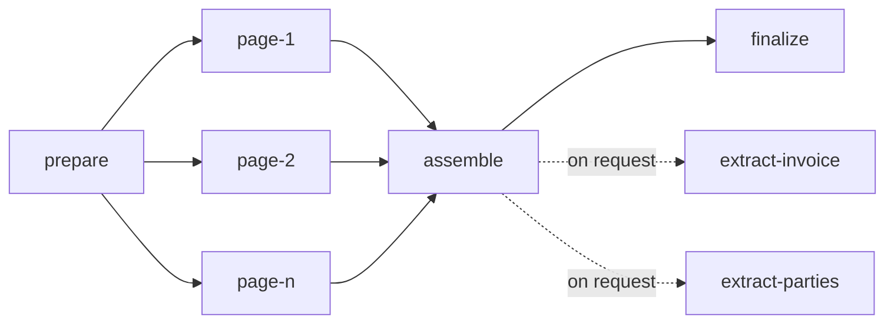

# Parse graph

## Overview

A parse is a small graph of tasks. This spec fixes its shape: which
tasks exist, what each reads and writes, which edges join them, and how
the parse's state follows from theirs. The unit that matters is the
page task. It is the unit of scheduling, of fairness, of retry and of
progress, which is what lets a 2-page parse finish while a 3,000-page
parse from the same tenant is still running, and lets a restart cost at
most the pages that were in flight.

## Current state

The earlier service ran a pipeline of stages (intake, recognition,
extraction, formatting) over a state envelope, in one process, as one
unit. The stage code is carried over as the bodies of the tasks below.
The envelope is not: state passes between tasks through the object
store, and no task receives another's memory.

## Design

### The graph



| Task | Reads | Writes | Cost | Calls a model |
|---|---|---|---|---|
| `prepare` | the source | the working copy, the manifest, the page and later tasks | 0 | no |
| `page-<n>` | the working copy, the manifest | `pages/<n>.png`, `pages/<n>.json` | 1 | once, unless the page is native |
| `assemble` | every page result | `document.json`, and the page results whose running headers and footers it marked | 0 | no |
| `finalize` | task rows | usage rows, the parse's terminal state | 0 | no |
| `extract-<name>` | the document | `fields/<name>.json` | 0 | yes, a text model |

An `extract-<name>` task is not part of what a submit creates. It is
added when a caller asks for a field ([[011-structured-extraction]]),
depends on `assemble` alone, and holds nothing else back: a parse ends
whether or not anyone asks it a question, and a question asked later
reads no page again.

`cost` is what the fair queue charges the tenant
([[006-fairness-and-priority]]): pages are the work, and the tasks
around them are free to schedule so that a parse is never stuck behind
its own tenant's backlog just to be assembled.

### prepare

`prepare` is the only task that exists at submit. It runs intake
([[009-intake]]): snapshot the source if it is a URL, detect the type,
unwrap and convert, count the pages, apply the page selection and the
limits. It then writes the manifest,

```json
{ "media_type": "application/pdf", "pages_total": 120, "selected": [1,2,3,7],
  "source": "reader" }
```

where `media_type` is what the working copy is after any container was
opened and any conversion done, and `source` says who produces the
pages' blocks, `reader` or `native`. The durable manifest also names
the working copy's key, `parses/<parse>/work/source.<ext>`. In one
transaction with it, `prepare` writes the rest of the graph: one
`page-<n>` task per selected page with `seq` equal to its position in
the selection, then `assemble` and `finalize` in state `blocked` with
their edges. Writing all page rows at once is deliberate: three
thousand rows are small for the database, the queue's order within a
tenant interleaves parses by `seq` so no cursor is needed, and the
parse's total is known to progress from the first moment.

`prepare` does not render pages. Each page task renders its own page
from the working copy, so no step ever holds more than one page image
and a retry of `prepare` repeats no rendering.

### page

A page task fetches the working copy into a size-bounded cache on the
worker's local disk, keyed by content hash, and then either

- copies the page's blocks from the native extraction, when the format
  carried its own structure, or
- renders the page to an image, calls the reader the policy chose
  ([[008-readers]]), validates the reply, and numbers the blocks. A
  rendered page with nothing on it is written as a succeeded page with
  no blocks, and no reader is called.

It writes the page result and completes. The page is readable through
the API from that moment ([[003-api]]). A page task that exhausts its
attempts writes a page result with `state: failed` and its error, and
settles as `failed`.

What a page task does next follows from the class of the reader's
error ([[008-readers]]), never from a status code:

| The reader's error | The page task | The page's error when it gives up |
|---|---|---|
| rate limited | waits and tries again; spends no attempt | `reader_unavailable`, only when the limit never lifts |
| retryable | spends an attempt, waits a backoff, tries again | `reader_unavailable` |
| invalid | spends an attempt; the second invalid reply sends the page once to the next reader in the chain, which gets attempts of its own; a pinned parse stays with its reader | `page_unreadable` |
| budget | fails the page at once | `budget_exhausted` |
| permanent | fails the page at once | `page_unreadable` |

A failure of the file itself, such as a page that cannot be rendered,
is not the reader's: no other attempt or reader changes it, and the
page fails at once with the file's own code.

### The steps as code

The work of a parse is two functions in `internal/parse` that hold no
state between calls. `Prepare` runs once per file: it tells what the
file is, opens and converts what needs it, counts the pages, selects
the ones to read, and returns the manifest, the working copy, and the
pages of a native format. `ReadPage` runs once per page: it renders
that page, has a reader read it, checks the answer, and numbers the
blocks. Neither knows about queues, tenants or storage, so whoever
schedules them, in one process or across many, can run pages in any
order, retry one without the others, and stop between any two.

### When pages fail

`assemble` is blocked by page tasks being settled, not by their
success: a `failed` page releases its dependents as a `succeeded` one
does. The document then lists that page as failed and has no blocks
for it. `finalize` sets the parse to `succeeded` when the number of
failed pages is at most the submit's `allow_failed_pages`, which is 0
unless the caller raised it, and to `failed` with `page_unreadable`
and the count of pages otherwise. Either way everything that was read
is kept and readable, and `POST /parses/{parse}/retry` re-queues only
the failed pages and the tasks downstream of them. Work a tenant paid
for is never discarded because a later page failed.

A failed `prepare`, `assemble` or `finalize` fails the parse. A failed
`extract-<name>` fails its field and leaves the parse as it was
([[011-structured-extraction]]).

### Parse state from task state

| Parse | When |
|---|---|
| `queued` | no task has been leased yet |
| `running` | any task has been leased and `finalize` has not settled |
| `succeeded`, `failed` | set by `finalize`, or by a failed `prepare` or `assemble` |
| `failed` with `deadline_exceeded` | the deadline passed before `finalize` settled |
| `canceled` | cancel was requested and no task is leased |

A canceled parse stops between pages: no further page is read, and
the result of a page that was being read when the cancel arrived is
dropped, so nothing is written after a cancel.

`progress.stage` is derived from which task kinds are unsettled, and
`pages_done` and `pages_failed` are counters advanced in the completing
transaction ([[004-durable-tasks]]), so reading progress is one row.

### Reuse

Before any work, submit looks for a succeeded parse with the same
owner, the same source content hash and the same options fingerprint:
the page selection, the reader chain (the pinned reader, or the
policy's chain), the languages, the version of the reader's
instruction, and the routing policy's version. Options that change
when the work runs and not what it produces, class, priority, deadline
and labels, are not part of it. When `reuse` is true and one exists, it is
returned. The lookup is an index on `parses (owner, content_sha256,
options_fp)`; no separate table holds it.

## Not in this spec

Spans of several pages in one task. A page per task is the first
version; a reader that takes several pages in one call is a later
change to the manifest and to `cost`, not to the graph. Tasks that
loop or branch on quality: escalation happens inside a page task
([[008-readers]]).

## Implementation status

Built:

- `internal/parse`: `Prepare` and `ReadPage` as described, the
  manifest, blank pages read with no call.
- `internal/run`: an in-process runner that drives those steps. It
  prepares a parse once, queues one job per selected page, reads pages
  with a fixed number of workers shared by every parse, applies the
  table of reader errors above including the one escalation, counts
  `pages_done` and `pages_failed`, assembles, and sets the terminal
  state by `allow_failed_pages`, cancel and deadline.
- Reuse by content hash and fingerprint, in `internal/httpapi`.

Remaining:

- The tasks themselves. Nothing here is a row: the runner keeps its
  queue in memory, so a restart loses every parse that had not ended
  ([[004-durable-tasks]]).
- `retry`, and `extract-<name>` tasks.
- The fingerprint covers the page selection, the reader chain and the
  languages. The instruction's version and the policy's version are
  not in it yet.
- The working copy cache on a worker's disk: the runner holds the
  working copy in memory.

## Acceptance criteria

| Criterion | Proven by |
|---|---|
| A parse of n selected pages writes exactly n page tasks plus the fixed tasks, and running `prepare` twice writes nothing more | a store test |
| With one worker killed after k pages, the completed parse made exactly n reader calls plus at most the number of tasks in flight at the kill | an end-to-end test with a counting stub reader |
| A parse with one unreadable page ends `failed`, returns the other pages and a document that marks the missing one, and after `retry` with a working reader ends `succeeded` having read one page | an end-to-end test |
| The same parse submitted with `allow_failed_pages: 1` ends `succeeded` with the failed page listed | an end-to-end test |
| Each row of the table of reader errors has a test in which a stub reader returns that class and the reader calls, the attempts and the page's error are as stated | a table test with a counting stub reader |
| Two parses of one tenant, 300 pages and 2 pages, submitted in that order to one worker: the 2-page parse finishes before the 300-page parse reaches page 10 | a dispatch test |
| A second submit of the same content and options returns the first parse with `reused: true` and creates no task | an API test |
| Peak worker memory for a 500-page parse is within 10% of the peak for a 5-page parse of the same page size | a memory test |
