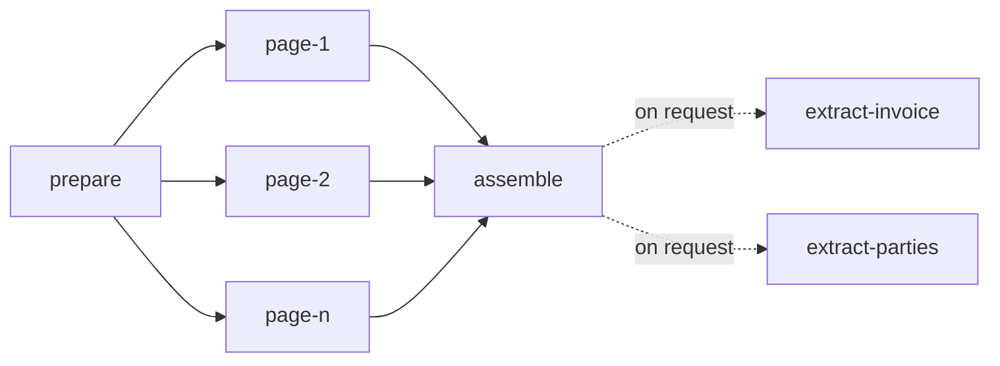

# Parse graph

## Overview

A parse is a small graph of tasks. This spec fixes its shape: which
tasks exist, what each reads and writes, when each comes to exist, and
how the parse's state follows from theirs. The unit that matters is the
page task. It is the unit of scheduling, of fairness, of retry and of
progress, which is what lets a 2-page parse finish while a 3,000-page
parse from the same tenant is still running, and lets a restart cost at
most the pages that were in flight.

## Current state

The earlier service ran a pipeline of stages (intake, recognition,
extraction, formatting) over a state envelope, in one process, as one
unit. The stage code is carried over as the bodies of the tasks below.
The envelope is not: state passes between tasks through the object
store, and no task receives another's memory.

### What changed in review

The first draft of this spec had five kinds of task joined by edge
rows, three of them free to the fair queue. The graph is fixed, so the
edges bought nothing a counter does not: `assemble` now comes to exist
when the last page settles, and `finalize` is no longer a task but the
end of `assemble`'s settle. A page of a format that carries its own
structure was a task that waited for a reader it never called; such
pages are now written by `prepare`. Every task that is dispatched is
charged ([[006-fairness-and-priority]]). And two things the draft
promised without a mechanism now have one: nothing is recorded after a
cancel, and a page's stored result is the one its row says was read.

## Design

### The graph



| Task | Reads | Writes | Charge | Calls a model |
|---|---|---|---|---|
| `prepare` | the source | the working copy, the manifest, the pages of a native format, the page tasks | 1 | no |
| `page-<n>` | the working copy, the manifest | the page's image and its result | its reader's `cost` | once, unless the page is blank |
| `assemble` | every page result | the document index, and the page results whose running headers and footers it marked | 1 | no |
| `extract-<name>` | the document | the field | its reader's `cost` per call | yes, a text model, once per window and per repair |

An `extract-<name>` task is not part of what a submit creates. It is
added when a caller asks for a field ([[011-structured-extraction]]),
needs only an assembled document, and holds nothing else back: a parse
ends whether or not anyone asks it a question, and a question asked
later reads no page again. It takes a slot in its reader's pool for
each call it makes and is charged for each ([[007-model-capacity]]).

The charge is what the fair queue adds to the tenant's virtual time
([[006-fairness-and-priority]]). No task is free. `prepare` and
`assemble` are ordered ahead of the same tenant's pages, so a parse is
never stuck behind its own tenant's backlog just to be assembled, and
they are charged like any task so that a tenant cannot be served
without advancing.

### prepare

`prepare` is the only task that exists at submit. It runs intake
([[009-intake]]): snapshot the source if it is a URL, detect the type,
unwrap and convert, count the pages, apply the page selection and the
limits, and reserve the pages against the group's daily budget
([[013-limits-and-usage]]). It then writes the manifest,

```json
{ "media_type": "application/pdf", "pages_total": 120, "selected": [1,2,3,7],
  "source": "reader" }
```

where `media_type` is what the working copy is after any container was
opened and any conversion done, and `source` says who produces the
pages' blocks, `reader` or `native`. The durable manifest also names
the working copy's key, `parses/<parse>/work/source.<ext>`.

What `prepare` writes next depends on `source`, in one transaction
with its own settle:

- **`reader`**: one `page-<n>` task per selected page, `queued`, with
  `seq` equal to its position in the selection, and the parse's
  `pages_open` set to their number. Writing all page rows at once is
  deliberate: three thousand rows are small for the database, the
  queue's order within a tenant interleaves parses by `seq` so no
  cursor is needed, and the parse's total is known to progress from the
  first moment.
- **`native`**: no page task. The pages exist as soon as the file was
  read, so `prepare` writes their results and inserts `assemble`. A
  3,000-sheet workbook is not 3,000 tasks waiting for a reader none of
  them calls.

`assemble` is not written with the pages. It has no row until it can
run ([[004-durable-tasks]]).

`prepare` does not render pages. Each page task renders its own page
from the working copy, so no step ever holds more than one page image
and a retry of `prepare` repeats no rendering.

### page

A page task fetches the working copy into a size-bounded cache on the
worker's local disk, keyed by content hash, renders the page to an
image, calls the reader it was claimed for ([[008-readers]]), validates
the reply, and numbers the blocks. A rendered page with nothing on it
is written as a succeeded page with no blocks and no reader is called;
its charge is corrected at settle to the floor of one unit
([[006-fairness-and-priority]]).

A page task writes its image and its result to keys that carry its
lease token, `pages/<n>.<token>.png` and `pages/<n>.<token>.json`, and
its settle records the result's key on its row
([[004-durable-tasks]]). Two workers that ran the same page after a
crash wrote two results; the row names the one whose settle was
accepted, and that is the one a caller reads. The page is readable
through the API from the moment its settle commits ([[003-api]]). A
page task that exhausts its attempts writes a page result with `state:
failed` and its error, and settles as `failed`.

What a page task does next follows from the class of the reader's
error ([[008-readers]]), never from a status code:

| The reader's error | The page task | The page's error when it gives up |
|---|---|---|
| rate limited | ends the attempt as a wait, spends no attempt, and is claimed again when its reader has room | `deadline_exceeded` on the parse, only when the limit never lifts |
| retryable | spends an attempt, waits a backoff, tries again | `reader_unavailable` |
| invalid | spends an attempt; the second invalid reply sends the page once to the next reader in the chain, which gets attempts of its own; a pinned parse stays with its reader | `page_unreadable` |
| budget | fails the page at once | `budget_exhausted` |
| permanent | fails the page at once | `page_unreadable` |

A failure of the file itself, such as a page that cannot be rendered,
is not the reader's: no other attempt or reader changes it, and the
page fails at once with the file's own code.

### assemble, and the end of a parse

The settle of a page decrements the parse's `pages_open`, and the
settle that takes it to zero inserts `assemble` in the same
transaction. Pages are counted as they settle, not as they succeed: a
`failed` page releases `assemble` as a `succeeded` one does.

`assemble` reads every page result by the key its row recorded, runs
the passes of [[010-assembly]], and writes the document index under its
own token. The index lists, for every page, its state and the key of
its result, so a page is found through its task row while the parse
runs and through the index after. The document then lists a failed
page as failed and has no blocks for it.

There is no `finalize` task. The settle of `assemble` ends the parse
in the same transaction: it records the index's key on the parse, sets
the parse to `succeeded` when the number of failed pages is at most the
submit's `allow_failed_pages`, which is 0 unless the caller raised it,
and to `failed` with `page_unreadable` and the count of pages
otherwise, rolls the tasks' usage into the meter and refunds the pages
that were reserved and not read ([[013-limits-and-usage]]), and deletes
the parse's `succeeded` task rows. Either way everything that was read
is kept and readable, and `POST /parses/{parse}/retry` re-queues only
the failed pages, sets `pages_open` to their number, and lets
`assemble` run again when they settle. Work a tenant paid for is never
discarded because a later page failed.

A failed `prepare` or `assemble` fails the parse. A failed
`extract-<name>` fails its field and leaves the parse as it was
([[011-structured-extraction]]).

### The steps as code

The work of a parse is two functions in `internal/parse` that hold no
state between calls. `Prepare` runs once per file: it tells what the
file is, opens and converts what needs it, counts the pages, selects
the ones to read, and returns the manifest, the working copy, and the
pages of a native format. `ReadPage` runs once per page: it renders
that page, has a reader read it, checks the answer, and numbers the
blocks. Neither knows about queues, tenants or storage, so whoever
schedules them, in one process or across many, can run pages in any
order, retry one without the others, and stop between any two.

### Parse state from task state

| Parse | When |
|---|---|
| `queued` | no task has been leased yet |
| `running` | a task has been leased and the parse has not ended |
| `succeeded`, `failed` | set by the settle of `assemble`, or by a failed `prepare` |
| `failed` with `deadline_exceeded` | the deadline passed before `assemble` settled |
| `canceled` | set by the cancel itself, in its own transaction |

A cancel moves the parse and its `queued` and `leased` tasks to
`canceled` at once ([[004-durable-tasks]]). A page that was being read
when the cancel arrived finishes against a row that is no longer
leased, so its settle is refused: its result is not recorded, progress
does not advance, and `assemble` is never inserted. Nothing is written
after a cancel. What was read before it stays readable.

`progress.stage` is derived from which task kinds are unsettled, and
`pages_done` and `pages_failed` are counters advanced in the settling
transaction ([[004-durable-tasks]]), so reading progress is one row.

### Reuse

Before any work, submit looks for a succeeded parse with the same
owner, the same source content hash and the same options fingerprint:
the page selection, the reader chain (the pinned reader, or the
policy's chain), the languages, the version of the reader's
instruction, and the routing policy's version. Options that change
when the work runs and not what it produces, class, priority, deadline
and labels, are not part of it. When `reuse` is true and one exists, it is
returned. The lookup is an index on `parses (owner, content_sha256,
options_fp)`; no separate table holds it.

## Not in this spec

Spans of several pages in one task. A page per task is the first
version; a reader that takes several pages in one call is a later
change to the manifest and to the charge, not to the graph. Tasks that
loop or branch on quality: escalation happens inside a page task
([[008-readers]]). A task in which a model works over a whole document
for minutes: the hooks that leave room for it are in
[[004-durable-tasks]], and its shape is not designed.

## Implementation status

Built:

- `internal/parse`: `Prepare` and `ReadPage` as described, the
  manifest, blank pages read with no call.
- `internal/run`: an in-process runner that drives those steps. It
  prepares a parse once, writes the pages of a native format from
  `Prepare` with no page job, queues one job per selected page
  otherwise, reads pages with a fixed number of workers shared by every
  parse, applies the table of reader errors above including the one
  escalation, counts `pages_done` and `pages_failed`, assembles, and
  sets the terminal state by `allow_failed_pages`, cancel and deadline.
  It differs from the table in one row: it has no pool and a parse may
  have no deadline, so a rate limit that does not lift ends the page as
  `reader_unavailable` after a fixed number of waits.
- Reuse by content hash and fingerprint, in `internal/httpapi`.

Remaining:

- The tasks themselves. Nothing here is a row: the runner keeps its
  queue in memory, so a restart loses every parse that had not ended
  ([[004-durable-tasks]]).
- Output keys that carry a token, and the document index listing them:
  the memory store keeps one result per page.
- `retry`, and `extract-<name>` tasks.
- The fingerprint covers the page selection, the reader chain and the
  languages. The instruction's version and the policy's version are
  not in it yet.
- The working copy cache on a worker's disk: the runner holds the
  working copy in memory.

## Acceptance criteria

| Criterion | Proven by |
|---|---|
| A parse of n selected pages of a format a reader reads writes exactly n page tasks and no `assemble` row until the last page settles; running `prepare` twice writes nothing more | a store test |
| A parse of a native format writes no page task: its pages are readable when `prepare` settles | a store test |
| With one worker killed after k pages, the completed parse made exactly n reader calls plus at most the number of tasks in flight at the kill | an end-to-end test with a counting stub reader |
| A page read by two workers after a kill is served from the key its row recorded, and the document index lists that key | an end-to-end test with a stub reader that answers differently each call |
| A parse with one unreadable page ends `failed`, returns the other pages and a document that marks the missing one, and after `retry` with a working reader ends `succeeded` having read one page | an end-to-end test |
| The same parse submitted with `allow_failed_pages: 1` ends `succeeded` with the failed page listed | an end-to-end test |
| Each row of the table of reader errors has a test in which a stub reader returns that class and the reader calls, the attempts and the page's error are as stated | a table test with a counting stub reader |
| A parse canceled while a page is being read is `canceled` when the cancel returns, and the page's result, when its call returns, is not recorded | an end-to-end test with a stub reader that blocks |
| When a parse settles, its `succeeded` task rows are gone, its counters and usage are on the parse, and every page is still readable | a store test |
| Two parses of one tenant, 300 pages and 2 pages, submitted in that order to one worker: the 2-page parse finishes before the 300-page parse reaches page 10 | a dispatch test |
| A second submit of the same content and options returns the first parse with `reused: true` and creates no task | an API test |
| Peak worker memory for a 500-page parse is within 10% of the peak for a 5-page parse of the same page size | a memory test |
