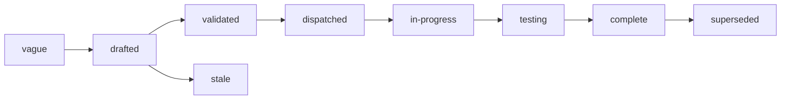

# Specs

Design specs for Lectio, a control plane that turns a file into a
structured document: the objects a document is made of, the API that
submits and reads a parse, the durable tasks a parse runs as, the queue
that shares workers and model capacity between tenants, and the
interface a model sits behind. One spec covers one component. Each
states the problem, the design with enough precision to build from,
and acceptance criteria that are testable statements. Spec 001 fixes
the architecture every other spec assumes; read it first. Spec 003 is
the contract a caller codes against. Specs 004 to 007 are the core of
the system: durability, the shape of a parse, fairness, and capacity.

## Layout

Flat files `specs/NNN-name.md` in one number space with `track: core`
in the frontmatter. Numbers are stable identifiers and are never
reused. Open specs sit here and are the work queue. A terminal spec
moves to `specs/.archive/` keeping its number so `depends_on` paths
still resolve.

Every spec in this tree is `drafted`: the set is under review as a
whole, and none is validated until that review ends.

## Index

| # | Spec | Effort | Status | Builds on |
|---|---|---|---|---|
| [001](001-architecture.md) | Architecture: one binary in two roles, Postgres for state and the queue, an object store for bytes, a model endpoint for pages | large | drafted | |
| [002](002-object-model.md) | Object model: file, parse, document, page, block, table, field, and where each is stored | medium | drafted | 001 |
| [003](003-api.md) | API: files, parses, pages, blocks, fields, events, and the errors a caller branches on | large | drafted | 001, 002 |
| [004](004-durable-tasks.md) | Durable tasks: the task table, claim under a lease, fencing, retry, capacity waits, cancel, and the sweeps | xlarge | drafted | 001, 002 |
| [005](005-parse-graph.md) | Parse graph: prepare, one task per page, assemble, extract, finalize, and what a parse keeps when part of it fails | large | drafted | 002, 004 |
| [006](006-fairness-and-priority.md) | Fairness and priority: groups, weights, the interactive and batch classes, and the order tasks are dispatched in | xlarge | drafted | 004, 005 |
| [007](007-model-capacity.md) | Model capacity: reader pools, slots held with the lease, rate limits, the breaker, and fallback | large | drafted | 004, 006 |
| [008](008-readers.md) | Readers: the interface a model sits behind, the chat adapter, the page contract, validation, and the routing policy | large | drafted | 002, 005, 007 |
| [009](009-intake.md) | Intake: detect the type, unwrap, convert, extract natively, count and render pages | large | drafted | 002, 005 |
| [010](010-assembly.md) | Assembly: from page results to one document, with running headers, tables across pages, an outline, renderings and chunks | medium | drafted | 002, 005 |
| [011](011-structured-extraction.md) | Structured extraction: fields shaped by a caller's schema, each citing the blocks it was read from | large | drafted | 008, 010 |
| [012](012-identity-and-authorization.md) | Identity and authorization: verifying a caller, the action vocabulary, the question to the authorizer, limits on an allow, the owner policy | medium | drafted | 001, 003 |
| [013](013-limits-and-usage.md) | Limits and usage: what a parse and a group are held to, whose credential a page is read with, and the meters Lectio records | medium | drafted | 005, 006, 012 |
| [014](014-sources-and-retention.md) | Sources and retention: uploads, fetching by URL, the snapshot, origin, and when files and results are deleted | medium | drafted | 002, 003, 004 |
| [015](015-observability.md) | Observability: one trace per parse, the processing record, queue and pool metrics, logs | medium | drafted | 004, 006, 007 |
| [016](016-distribution.md) | Distribution: the repository scaffold, the binary and its images, configuration, the stubs, test tiers, and release | large | drafted | 001 |

## Build order

The numbers are identifiers, not the order of work. The order is:

1. **Scaffold** (016): the module, the gate, the stubs, the store
   conformance harness.
2. **One page, durably** (002, 004, 005, 008 with the stub reader, 014
   uploads): a parse of an image file survives a killed worker.
3. **The contract** (003, 012): the API over that, with identity and
   the owner policy.
4. **Many tenants** (006, 007, 013): fairness, pools, limits, meters,
   proven by the simulation and the soak.
5. **Real documents** (009, 010): intake, rendering, assembly.
6. **Fields** (011), **telemetry** (015), and the first release.

Steps 2 to 4 are where this system differs from a script that calls a
model in a loop, and they come before breadth of formats on purpose.
