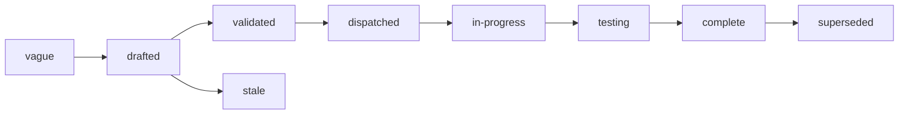

# Specs

Design specs for Lectio, a control plane that turns a file into a
structured document: the objects a document is made of, the API that
submits and reads a parse, the durable tasks a parse runs as, the queue
that shares workers and model capacity between tenants, and the
interface a model sits behind. One spec covers one component. Each
states the problem, the design with enough precision to build from,
and acceptance criteria that are testable statements. Spec 001 fixes
the architecture every other spec assumes; read it first. Spec 003 is
the contract a caller codes against. Specs 004 to 007 are the core of
the system: durability, the shape of a parse, fairness, and capacity.

## Layout

Flat files `specs/NNN-name.md` in one number space with `track: core`
in the frontmatter. Numbers are stable identifiers and are never
reused. Open specs sit here and are the work queue. A terminal spec
moves to `specs/.archive/` keeping its number so `depends_on` paths
still resolve.

Specs 001 to 016 are `validated`: the set was reviewed as a whole, by
three readers working apart, and the control plane, the reader
interface, the prompts, assembly and intake were revised from what they
found. Specs 004 to 007, the control plane, and specs 012 to 014,
identity, limits and retention, are `in-progress`. A scaffold of the parsing path and the API exists
beside the specs, and each spec says under `Implementation status`
what of it is built and what remains. Spec 017 is `vague`: a problem
statement with a proposed shape and the questions that have to be
answered before it is a design.

## Index

| # | Spec | Effort | Status | Builds on |
|---|---|---|---|---|
| [001](001-architecture.md) | Architecture: one binary in two roles, Postgres for state and the queue, an object store for bytes, a model endpoint for pages | large | validated | |
| [002](002-object-model.md) | Object model: file, parse, document, page, block, table, field, and where each is stored | medium | validated | 001 |
| [003](003-api.md) | API: files, parses, pages, blocks, fields, events, and the errors a caller branches on | large | validated | 001, 002 |
| [004](004-durable-tasks.md) | Durable tasks: the task table, the worker's lease and exchange, fencing, retry, cancel, and the sweeps | xlarge | in-progress | 001, 002 |
| [005](005-parse-graph.md) | Parse graph: prepare, one task per page, assemble, extraction on request, and what a parse keeps when part of it fails | large | in-progress | 002, 004 |
| [006](006-fairness-and-priority.md) | Fairness and priority: groups and their projects, weights, the interactive and batch classes, and the order tasks are dispatched in | xlarge | in-progress | 004, 005 |
| [007](007-model-capacity.md) | Model capacity: reader pools, slots held with the lease, rate limits, the breaker, and fallback | large | in-progress | 004, 006 |
| [008](008-readers.md) | Readers: the interfaces a model sits behind, the adapters, the page contract, validation, and the routing policy | large | validated | 002, 005, 007 |
| [009](009-intake.md) | Intake: detect the type, unwrap, convert, extract natively, count and render pages | large | validated | 002, 005 |
| [010](010-assembly.md) | Assembly: from page results to one document, with running headers, tables across pages, an outline, and the views a result is read in | medium | validated | 002, 005 |
| [011](011-structured-extraction.md) | Structured extraction: fields shaped by a caller's schema, each citing the blocks it was read from | large | validated | 008, 010 |
| [012](012-identity-and-authorization.md) | Identity and authorization: verifying a caller, the action vocabulary, the question to the authorizer, limits on an allow, the owner policy | medium | in-progress | 001, 003 |
| [013](013-limits-and-usage.md) | Limits and usage: what a parse and a group are held to, whose credential a page is read with, and the meters Lectio records | medium | in-progress | 005, 006, 012 |
| [014](014-sources-and-retention.md) | Sources and retention: uploads, fetching by URL, the snapshot, origin, and when files and results are deleted | medium | in-progress | 002, 003, 004 |
| [015](015-observability.md) | Observability: a trace per task linked to its parse, the processing record, queue and pool metrics, logs | medium | validated | 004, 006, 007 |
| [016](016-distribution.md) | Distribution: the repository scaffold, the binary and its images, configuration, the stubs, test tiers, and release | large | validated | 001 |
| [017](017-agent-driven-parsing.md) | Agent-driven parsing: reader tiers, the text layer, reading a page again, and what an agent needs from the core | xlarge | vague | 002, 003, 008, 009 |

## Build order

The numbers are identifiers, not the order of work. The order is:

1. **Scaffold** (016): the module, the gate, the stubs, the store
   conformance harness. Built: the module, the gate, and a stub reader
   in process. Not built: the stub services and the conformance
   harness.
2. **One page, durably** (002, 004, 005, 008 with the stub reader, 014
   uploads): a parse of an image file survives a killed worker. Built:
   the object model, the steps of a parse, the readers and uploads,
   with a parse of an image file running end to end in one process;
   and the task store over Postgres, with the exchange a worker makes
   as one function in the database. Not built: the worker process and
   the object store, so nothing a server runs is durable yet.
3. **The contract** (003, 012): the API over that, with identity and
   the owner policy. Built: the contract and every route of it that is
   not marked planned, with a static token and owner scoping; and, as
   libraries, the vocabulary, the verifier, the authorizer client and
   the owner policy. Not built: the handlers asking them.
4. **Many tenants** (006, 007, 013): fairness, pools, limits, meters,
   proven by the simulation and the soak. Built, in the task store:
   the fair queue and the pools, proven at the store by the dispatch
   simulation. Not built: limits, meters and the soak.
5. **Real documents** (009, 010): intake, rendering, assembly. Built:
   detection, unwrapping, counting and selection, native text, Markdown
   and CSV, image rendering, and assembly with its views. Not built:
   PDF rendering, conversion, and native office formats.
6. **Fields** (011), **telemetry** (015), and the first release. Built:
   the extractor interface and its adapters; and for the release, the
   2 images, the deploy tree and the workflow that publishes them,
   which has not run. Not built: the rest.

Steps 2 to 4 are where this system differs from a script that calls a
model in a loop, and they come before breadth of formats on purpose.
The scaffold went wide before it went deep: it fixes the interfaces
and the contract every later step builds on, and proves no durability
or fairness claim.
